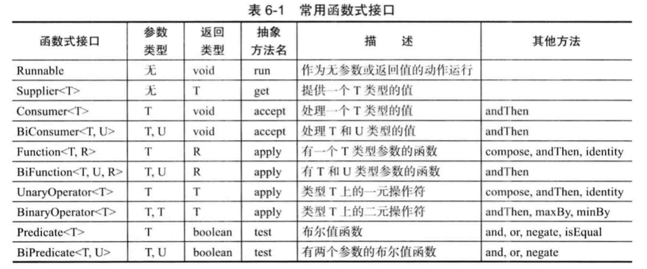
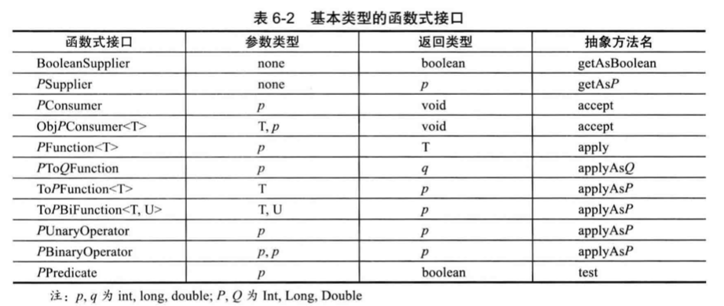

## Section 6 接口、lambda 表达式与内部类

### 6.1 接口

#### **6.1.1 接口概念**

- 接口不是类，而是对类的一组需求描述
- 接口中的所有方法自动地属于 `public` 因此，不必提供关键字 `public`；但是在自己的类实现相关接口时，必须声明为`public`，不然编译器会认为该方法为包可见性。
- 接口绝不能含有实例域

假设希望使用 Arrays 类的 sort 方法对 Employee 对象数组进行排序，Employee 类就必须实现 Comparable 接口：

```java
// 1. 将类声明为实现给定的接口 - 使用到了泛型
class Employee implements Comparable<Employee>

// 2. 对接口中的所有方法进行定义
public int compareTo(Employee other){
	return Double.compare(salary, other,salary);
}

// 3. Arrays.sort
Employee[] staff = new Employee[3];
Arrays.sort(staff);
```

**知识点1：**

> 要让一个类使用排序服务必须让它实现 compareTo 方法。 这是理所当然的， 因为要向 sort 方法提供对象的比较方式。 但是为什么不能在 Employee 类直接提供一个 compareTo 方法， 而必须实现 Comparable 接口呢?

原因：Java 是一种**强类型 ( strongly typed ) 语言**，在调用方法的时候， 编译器将会检查这个方法是否存在。如果继承了Comparable接口，则可以确保此对象拥有compareTo 方法。

**知识点2:**

对于任意的 x 和 y, 实现必须能够保证 `sgn(x.compareTo(y)) = -sgn (y.compareTo(x)`；简单地讲，如果调换 compareTo 的参数， 结果的符号也应该调换(而不是实际值)。

假设Manager扩展了Employee，而Employee中实现了`Compareble<Employee>`,如果Manager覆盖了compareTo如果将函数写成下面这样将会带来报错：

```java
class Manager extends Employee{
  public int compareTo(Employee other){
    Manager otherManager = (Manager) other; // NO
    ...
  }
  ...
}
```

所以如果子类比较含义不一样，则需要首先进行检测：`if (getClassO != other.getClassO) throw new ClassCastExceptionO;`;否则如果可以对两个不同类型对象进行比较，则应该在超类中提供了一个compareTo方法，并将其声明为final类型。


####  6.1.2 接口的特性

+ 接口变量必须引用实现了接口的类对象: `Comparable x = new Employee(. . .); `

+ 与可以建立类的继承关系一样， 接口也可以被扩展。这里允许存在多条从具有较高通用 性的接口到较高专用性的接口的链：

```java
// 假设有一个称为 Moveable 的接口:
public interface Moveable{
	void move(double x, double y); 
}

// 以它为基础扩展一个叫做 Powered 的接口:
// 虽然在接口中不能包含实例域或静态方法， 但却可以包含常量
public interface Powered extends Moveable {
	double milesPerCallon();
  double SPEED_LIMIT = 95; // a public static final constant
}

```

+ 尽管每个类只能够拥有一个超类， 但却可以实现多个接口。这就为定义类的行为提供了极大的灵活性。


#### 6.1.3 接口与抽象类

为什么不将 Comparable 直接设计成如下所示的 抽象类:

```java
abstract class Comparable{ // why not?
		public abstract int compareTo(Object other); 
}

```

然后， Employee 类再直接扩展这个抽象类， 并提供 compareTo 方法的实现:

```java
class Employee extends Comparable{ // why not?
	public int compareTo(Object other) {...}
}  
```

**原因：每个类只能扩展于一个类。** Java 的设计者选择了不支持多继承， 其主要原因是多继承会让语言本身变得非常复杂 (如同 C++) ，效率也会降低 。


#### 6.1.4 静态方法

在 Java SE 8 中， 允许在接口中增加静态方法。目前为止， 通常的做法都是将静态方法放在伴随类中；不过在Java SE 8之后的版本中，不再需要为实用工具方法另外提供一个伴随类。

```java
public interface Path{
  public static Path get(String first, String... more){
    return Fi1eSystems.getDefault().getPath(first, more)
  }
  ...
}

```


#### 6.1.5 默认方法

可以为接口方法提供一个默认实现。 必须用 default 修饰符标记这样一个方法。

```java
public interface Comparable<T>{
	default int compareTo(T other){
    return 0;
  } // By default, all elements are the same
}
```

当然， 这并没有太大用处， 因为 Comparable 的每一个实际实现都要覆盖这个方法。

**使用场景1:**

比如希望发生鼠标点击时候得到通知，现在有一个鼠标监听的接口，但是在大多数情况下，仅需要关注其中的一两个事件类型，可以把所有方法声明为默认方法，默认方法什么也不做。

```java
public interface MouseListener {
	default void mousedieked(MouseEvent event){}; 
  default void mousePressed(MouseEvent event){}; 
  default void mouseReleased(MouseEvent event){}; 
  default void mouseEntered(MouseEvent event){}; 
  default void mouseExited(MouseEvent event){};
}
```

这样一来， 实现这个接口的程序员只需要为他们真正关心的事件覆盖相应的监听器。

**使用场景2:**

默认方法可以调用任何其他方法。 例如， Collection 接口可以定义一个便利方法: 这样实现 Collection 的程序员就不用操心实现 isEmpty 方法了。

```java
public interface Collection {
	int size(); // An abstract method
  default boolean isEmpty(){
    return size() == 0;
  }
  ...
}
```


#### 6.1.6 解决默认方法冲突

**如果先在一个接口中将一个方法定义为默认方法， 然后又在超类或另一个接口中定义了同样的方法， 会发生什么情况?** 

+ 超类优先：优先使用超类提供的具体方法（保证默认方法不会影响到之前可以正常工作的代码）
+ 接口冲突：在类中必须覆盖这个方法来解决冲突

> 千万不要让一个默认方法重新定义 Object 类中的某个方法。 例如，不能为 toString 或 equals 定义默认方法， 尽管对于 List 之类的接口这可能很有吸引力， 由于“ 类优先” 规则， 这样的方法绝对无法超越 Object.toString 或 Objects.equals。


### 6.2 接口示例

我们将给出接口的另外一些示例， 可以从中了解接口的实际使用。

#### 6.2.1 接口与回调

回调（callback）指出某个特定事件发生时应该采取的动作。例如我们现在希望需要每隔10s钟打印一条信息，这就需要一个实现ActionListener 接口的类来完成任务，样例如下：

```java
public interface ActionListener{
  void actionPerfonned(ActionEvent event);
}

class TinePrinter implements ActionListener{
  public void actionPerformed(ActionEvent event){
    System.out.println("At the tone, the time is " + new Date());
    Toolkit.getDefaultToolkit().beep();
  }
}

//  构造这个类的一个对象， 并将它传递给 Timer 构造器。
// Timer 是一个与本例无关的类， 它主要用于调度后台任务。
ActionListener listener = new TimePrinter();
Timer t = new Timer(10000,listener);
t.start(); // 启动定时器
```


#### 6.2.2 Comparator 接口

现在假设我们希望按长度递增的顺序对字符串进行排序， 而不是按字典顺序进行排序。

要处理这种情况，Arrays.sort方法还有第二个版本，传入数组和一个比较器 (comparator)作为参数，比较器是实现了Comparator接口的类的实例。

```java
public interface Comparator<T>{ 
  int compare(T first, T second);
}
 
// 要按长度比较字符串， 可以如下定义一个实现 Comparator<String> 的类:
class LengthComparator implements Comparator<String>{
  public int compare(String first, String second){
    return first.length() - second.length();
  }
}

// 具体完成比较时，需要建立一个实例:
Comparator<String> comp = new LengthComparator();
if(comp.compare(words[i],words[j]) > 0) ...
```

要对一个数组排序， 需要为 Arrays.sort 方法传人一个 LengthComparator 对象:

```java
String[] friends = { "Peter", "Paul", "Mary" }; 
Array.sort(friends, new LengthComparator()):
```

在 6.3 节中我们会了解， 利用 lambda 表达式可以更容易地使用 Comparator。


#### 6.2.3 对象克隆

Cloneable 接口指示一个类提供了一个安全的 clone 方法。

+ 为对象引用的变量建立副本时 - 原变量和副本都是同一个对象的引用
+ 如果希望 copy 是一个新对象， 它的初始状态与 original 相同， 但是之后它们各自会有自 己不同的状态， 这种情况下就可以使用 clone 方法。

 clone 方法是 Object 的一个 protected 方法， 这说明你的代码不能直接调用这个方法。 换句话说，只有 Employee 类可以克隆 Employee 对象。如果想要自己的对象可以被clone，类必须：

+ 实现 Cloneable 接口;
+ 重新定义 clone 方法， 并指定 public 访问修饰符。

> Object 类中 clone 方法声明为 protected, 所以你的代码不能直接调用 anObject. clone() 。但是， 不是所有子类都能访问受保护方法吗? 不是所有类都是 Object 的子类吗? 幸运的是， 受保护访问的规则比较微妙(见第 5 章)。子类只能调用受保护的 clone 方法来克隆它自己的对象。 必须重新定义 clone 为 public 才能允许所有方法克隆对象。

Cloneable 接口的出现与接口的正常使用并没有关系。这个接口只是作为一个标记， 指示类设计者了解克隆过程。对象对于克隆很“ 偏执”， 果一个对象请求克隆， 但没有实现这个接口， 就会生成一个受査异常。

>Cloneable接口是Java提供的一组标记接口 (tagginginterface)之一,有些程序员称之为记号接口。它唯一的作用就是允许 在类型查询中使用 instanceof: if (obj instanceof Cloneable) . . .

**即使 clone 的默认(浅拷贝)实现能够满足要求， 还是需要实现 Cloneable 接口，将 clone 重新定义为public，再调用super.clone() 。下面给出一个例子:**

如果在一个对象上调用clone, 但这个对象的类并没有实现Cloneable接口，Object类 的clone方法就会拋出一个CloneNotSupportedException()

```java
class Employee implements Cloneable{
	// raise visibility level to public, change return type
	public Employee clone() throws CloneNotSupportedException{
    return (Employee) super.clone();
  }
}
```

下面来看创建深拷贝的 done 方法的一个例子:

```java
class Employee implements Cloneable{
	...
	public Employee clone() throws CloneNotSupportedException{
    // call Object,clone()
    Employee cloned = (Employee) super.clone();
    
    // clone mutable fields
    cloned.hireDay = (Date) hireDay.clone();
    return cloned;
  }
}
```

**知识点： 所有数组类型都有一个 public 的 clone 方法， 而不是 protected: 可以用这个方法建立一个新数组， 包含原数组所有元素的副本。例如:**

```java
int[] luckyNumbers = { 2, 3, 5, 7, 11, 13 }; 
int[] cloned = luckyNumbers.done();
cloned[5] = 12; // doesn't change luckyNumbers[5]
```


### 6.3 lambda表达式

#### 6.3.1 为什么引入 lambda 表达式

在6.2的定时任务和排序任务中，都有一个共同点：这两个例子有一些共同点， 都是将一个代码块传递到某个对象(一个定时器， 或者一个 sort 方法 ) 这个代码块会在将来某个时间调用。

> 到目前为止， 在 Java 中传递一个代码段并不容易， 不能直接传递代码段 。Java 是一种面 向对象语言， 所以必须构造一个对象， 这个对象的类需要有一个方法能包含所需的代码。

在其他语言中， 可以直接处理代码块。Java 设计者很长时间以来一直拒绝增加这个特性。 毕竟， Java 的强大之处就在于其简单性和一致性。 设计者们做了多年的尝试， 终于找到一种适合 Java 的设计来支持函数式编程。


#### 6.3.2 lambda表达式语法

再来考虑上一节讨论的排序例子。 我们传人代码来检查一个字符串是否比另一个字符串短。 这里要计算:

```
first.length() - second.length()
```

first 和 second 是什么? 它们都是字符串。 Java 是一种强类型语言， 所以我们还要指定它们的类型:

```
(String first,String second)
	-> first.length() - second.lenth() 
```

这就是你看到的第一个表达式。lambda表达式就是一个**代码块**， 以及必须传入代码的**变量规范**。

已经见过 Java 中的一种 lambda 表达式形式: 参数， 箭头以及一个表达式。 如果代码要完成的计算无法放在一个表达式中， 可以把这些代码放在{}中，并包含显式的 return 语句。 例如:

```java
(String first,String second)->{
  if (first.length() < second.length()) return -1;
  else if (first.length() > second.length()) return 1;
  else return 0;
}
```

**即使 lambda 表达式没有参数， 仍然要提供空括号， 就像无参数方法一样:**

```java
()->{for(int i = 100;i >= 0; i--) System.out.println(i);}
```

**如果可以推导出一个 lambda 表达式的参数类型， 则可以忽略其类型。 例如:**

```java
Comparator<String> comp = (first,second) -> first.length() - second.length();
```

而原来如果实现上述操作需要代码为：

```java
public interface Comparator<T>{ 
  int compare(T first, T second);
}
 
// 要按长度比较字符串， 可以如下定义一个实现 Comparator<String> 的类:
class LengthComparator implements Comparator<String>{
  public int compare(String first, String second){
    return first.length() - second.length();
  }
}

// 具体完成比较时，需要建立一个实例:
Comparator<String> comp = new LengthComparator();
```

**如果方法只有一个参数， 而且这个参数的类型可以推导得出， 那么甚至还可以省略小括号:**

```java
ActionListener listener = event->System.out.println("the time is " + new Date());
```

而原来如果实现上述操作需要代码为：

```java
public interface ActionListener{
  void actionPerfonned(ActionEvent event);
}

class TinePrinter implements ActionListener{
  public void actionPerformed(ActionEvent event){
    System.out.println("At the tone, the time is " + new Date());
    Toolkit.getDefaultToolkit().beep();
  }
}

ActionListener listener = new TimePrinter();
```

无需指定 lambda 表达式的返回类型，lambda 表达式的返回类型总是会由上下文推导得出。

**注意：如果一个 lambda 表达式只在某些分支返回一个值， 而在另外一些分支不返回值， 这是不合法的。 例 如，`(int x) -> { if (x >= 0) return 1; }` 就不合法。**


#### 6.3.3 函数式接口

对于**只有一个抽象方法**的接口， 需要这种接口的对象时， 就可以提供一个 lambda 表达 式。 这种接口称为**函数式接口** (functional interface )。

为了展示如何转换为函数式接口， 下面考虑 Arrays.sort 方法。它的第二个参数需要一个 Comparator 实例， Comparator 就是只有一个方法的接口， 所以可以提供一个 lambda 表达式:

```java
Arrays.sort(words, (first,second)->first.length()-second.length());
```

> 在底层， Arrays.sort 方法会接收实现了` Comparator<String> `的某个类的对象。 在这个对象上调用 compare 方法会执行这个 lambda 表达式的体。这些对象和类的管理完全取决于具体实现， 与使用传统的内联类相比， 这样可能要高效得多。 最好把 lambda 表达式看作是一 个函数， 而不是一个对象， 另外要接受 lambda 表达式可以传递到函数式接口。

lambda 表达式可以转换为接口， 这一点让 lambda 表达式很有吸引力。具体的语法很简短,下面再来看一个例子:

```java
ActionListener listener = event->{
	System.out.println("the time is " + new Date());
	Toolkit.getDefaultToolkit().beep();
}
```

实际上， 在 Java 中， 对 lambda 表达式所能做的也只是能转换为函数式接口。在其他支持函数字面量的程序设计语言中，可以声明函数类型(如(String,String)-> int)、声明这些类型的变量， 还可以使用变量保存函数表达式。 **不过， Java 设计者还是决定保持我们熟悉的接口概念， 没有为 Java 语言增加函数类型。**


#### 6.3.4 方法引用

有时，可能已经有现成的方法可以完成你想要传递到其他代码的某个动作。例如， 假设你希望只要出现一个定时器事件就打印这个事件对象。 当然，为此也可以调用:

```java
Timer t = new Timer(1000, event -> System.out.println(event));
```

但是， 如果直接把 println 方法传递到 Timer 构造器就更好了。具体做法如下:

```java
Timer t = new Timer(1000, System.out::println);
```

表达式 `System.out::println` 是一个**方法引用(method reference)**, 它等价于 lambda 表达式 `x ->System.out.println(x)`

再来看一个例子， 假设你想对字符串排序， 而不考虑字母的大小写。可以传递以下方法表达式:

```
Arrays.sort (strings，String::compareToIgnoreCase)
```

可以在方法引用中使用 this 参数。 例如，`this::equals` 等同于 `x -> this.equals(x)`。 使用 super 也是合法的。下面的方法表达式`super::instanceMethod` 会调用给定方法的超类版本。


#### 6.3.5 构造器引用

**构造器引用与方法引用很类似， 只不过方法名为 new**。 例如， Person::new 是 Person 构造器的一个引用。哪一个构造器呢? 这取决于上下文。假设你有一个字符串列表。可以把它转换为一个 Person 对象数组， 为此要在各个字符串上调用构造器， 调用如下:

```java
ArrayList<String> names = ...;
Stream<Person> stream = names.stream().map(Person::new); 
List<Person> people = stream.col1ect(Col1ectors.toList());
```

> 将在卷 II 的第 1 章讨论 stream、map 和 collect 方法的详细内容。 就现在来说， 重点是 map 方法会为各个列表元素调用 Person(String) 构造器。 如果有多个 Person 构造器， 编译器会选择有一个 String 参数的构造器， 因为它从上下文推导出这是在对一个字符串调用构造器。

可以用数组类型建立构造器引用。 例如， int[]::new 是一个构造器引用， 它有一个参数: 即数组的长度。这等价于 lambda 表达式 x -> new int[x]

Java 有一个限制， 无法构造泛型类型 T 的数组。数组构造器引用对于克服这个限制很有用。 表达式 `new T[n]` 会产生错误， 因为这会改为 `new Object[n]` 。对于开发类库的人来说， 这是一个问题。 例如， 假设我们需要一个 Person 对象数组。 Stream 接口有一个 toArray 方法可以返回 Object 数组:

```java
Object[] people = stream.toArray();
```

不过， 这并不让人满意。 用户希望得到一个 Person 引用数组， 而不是 Object 引用数组。 流库利用构造器引用解决了这个问题。 可以把 Person[]::new 传入 toArray 方法:

```
Person[] people = stream.toArray(Person[]::new):
```

toArray 方法调用这个构造器来得到一个正确类型的数组,然后填充这个数组并返回。


#### 6.3.6 变量作用域

通常， 你可能希望能够在 lambda 表达式中访问外围方法或类中的变量。考虑下面这个例子:

```java
public static void repeatMessage(String text, int delay){
  ActionListener listener = event -> {
    System.out.println(text);
    Toolkit.getDefaultToolkit().beep();
  }
  new Timer(delay, listener).start();
}
```

来看这样一个调用:

```java
repeatMessage("Hello", 1000); // Prints Hello every 1,000 milliseconds
```

现在来看 lambda 表达式中的变量 text 。注意这个变量并不是在这个 lambda 表达式中定 义的。 实际上， 这是 repeatMessage 方法的一个参数变量。

如果再想想看， 这里好像会有问题， 尽管不那么明显：**lambda 表达式的代码可能会在 repeatMessage 调用返回很久以后才运行， 而那时这个参数变量已经不存在了。** **如何保留 text 变量呢?**

理解：lambda表达式由3个部分组成：

+ 一个代码块;
+ 参数;
+ 自由变量的值， 这是指非参数而且不在代码中定义的变量。

在我们的例子中， 这个 lambda 表达式有 1 个自由变量 text，结构必须存储自由变量的值， 在这里就是字符串 "Hello"。 我们说它被 lambda 表达式捕获captured 。

**要确保所捕获 的值是明确定义，并且在 lambda 表达式中， 只能引用值不改变的变量。 下面的做法是不合法的:**

```java
public static void countDown(int start, int delay){
  ActionListener listener = event -> {
    start--; // Error: can't mutata captured variable
    Toolkit.getDefaultToolkit().beep();
  }
  new Timer(delay, listener).start();
}
```

之所以有这个限制是有原因的。 如果在 lambda 表达式中改变变量， 并发执行多个动作时就会不安全。 内容详见第 14 章。另外如果在 lambda 表达式中引用变量， 而这个变量可能在外部改变， 这也是不合法的：

```java
 public static void repeat(String text, int count){
   for (int i = 1; i <= count; i++){
     ActionListener listener = event ->{
       System.out.println(i+":"+text);
       // Error:cannot refer to changing
     }
     new Timer(1000,listener).start();
   }
 }
```

> 这里有一条规则: lambda 表达式中捕获的变量必须实际上是最终变量 ( effectively final )，实际上的最终变量是指， 这个变量初始化之后就不会再为它赋新值。 

lambda 表达式的体与嵌套块有相同的作用域。 这里同样适用命名冲突和遮蔽的有关规则。 在 lambda 表达式中声明与一个局部变量同名的参数或局部变量是不合法的。

```java
Path first = Path.get("/usr/bin");
Comparator<String> comp = (first,second)->first.length()-second.length();
// Error:variable first already defined
```


#### 6.3.7 处理lambda表达式

到目前为止已经了解如何生成 lambda 表达式， 如何把 lambda 表达式传递到需要一个函数式接口的方法。下面来看如何编写方法处理 lambda 表达式：

使用 lambda 表达式的重点是**延迟执行（deferred execution ）** 毕竟， 如果想耍立即执行代码， 完全可以直接执行， 而无需把它包装在一个lambda 表达式中。 之所以希望以后再执行代码， 这有很多原因， 如:

+ 在一个单独的线程中运行代码
+ 多次运行代码
+ 在算法的适当位置运行代码(例如， 排序中的比较操作) 
+ 发生某种情况时执行代码(如， 点击了一个按钮， 数据到达， 等等) 
+ 只在必要时才运行代码

下面来看一个简单的例子。 假设你想要重复一个动作 n 次。 将这个动作和重复次数传递到一个 repeat 方法:

```java
repeat(10, () -> System.out.println("Hello, World!"));
```

要接受这个 lambda 表达式， 需要选择一个函数式接口。 表 6-1 列 出了 Java API 中提供的最重要的函数式接口。 



在这里， 我们可以使用 Runnable 接口: 需要说明， 调用 action.runO 时会执行这个 lambda 表达式的主体。

```java
public static void repeat(int n, Runnable action){
  for(int i=0;i < n; i++) action.run();
}
```

现在让这个例子更复杂一些，我们希望告诉这个动作它出现在哪一次迭代中。 为此，方法有一个 int 参数而且返回类型为 void。处理 int 值的标准接口如下:

```java
public interface IntConsumer{
  void accept(int value);
}

// 给出reapeat方法的改进版本
public static void repeat(int n,IntConsumer action){
  for(int i = 0;i < n;i++) action.accept(i);
}

// 可以如下调用它:
repeat(10, i -> System.out.println("Countdown: " + (9 - i))) ;
```

表 6-2 列出了基本类型 int、 long 和 double 的 34 个可能的规范。 **最好使用这些特殊化规范来减少自动装箱**。 出于这个原因， 我在上一节的例子中使用了 `IntConsumer` 而不是`Consumer<lnteger>` 。



> 如果设计你自己的接口， 其中只有一个抽象方法， 可以用 @FunctionalInterface 注 解来标记这个接口。 这样做有两个优点。 如果你无意中增加了另一个非抽象方法， 编译器会产生一个错误消息。 另外 javadoc 页里会指出你的接口是一个函数式接口。


#### 6.3.8 再谈 Comparator

Comparator 接口包含很多方便的静态方法来创建比较器。 这些方法可以用于 lambda 表达式或方法引用。

**静态 comparing 方法取一个“ 键提取器” 函数**。 对要比较的对象应用这个函数， 然后对返回的键完成比较。 例如， 假设有一个 Person 对象数组， 可以如下按名字对这些对象排序:

```java
Arrays.sort(people, Comparator.comparing(Person::getName));
```

可以把比较器与 thenComparing 方法串起来。 例如:

```java
Arrays.sort(people,Comparator.comparing(Person::getlastName).thenConiparing(Person::getFi rstName));
```

这些方法有很多变体形式。 **可以为 comparing 和 thenComparing 方法提取的键指定一个比较器**。例如， 可以如下根据人名长度完成排序:

```
Arrays.sort(people, Comparator.companng(Person::getName,(s, t) -> Integer.compare(s.1ength(), t.length())));
```

另外， comparing 和 thenComparing 方法都有变体形式， 可以避免 int、 long 或 double 值 的装箱。 要完成前一个操作， 还有一种更容易的做法:

```
Arrays.sort(people, Comparator.comparingInt(p -> p.getName().length()));
```

如果键函数可以返回null, 可能就要用到nullsFirst和nullsLast适配器。这些静态方法会修改现有的比较器， 从而在遇到 null 值时不会抛出异常， 而是将这个值标记为小于或大于正常值。例如，假设一个人没有中名时getMiddleName会返回一个null, 就可以使用 `Comparator.comparing(Person::getMiddleName(), Comparator.nullsFirst(...))`

nullsFirst()方法需要一个比较器，naturalOrder方法可以为任何实现了Comparable的类建立一个比较器。在这里，`Comparator.<String>naturalOrder`可以如下使用：

```
Arrays.sort(people, comparing(Person::getMiddleName,nullFirst(naturalOrder())));
```


### 6.4 内部类

内部类(inner class ) 是定义在另一个类中的类。 为什么需要使用内部类呢? 其主要原因有以下三点:

+ 内部类方法可以访问该类定义所在的作用域中的数据， 包括私有的数据。
+ 内部类可以对同一个包中的其他类隐藏起来。
+ 当想要定义一个回调函数且不想编写大量代码时，使用匿名(anonymous) 内部类比较便捷。