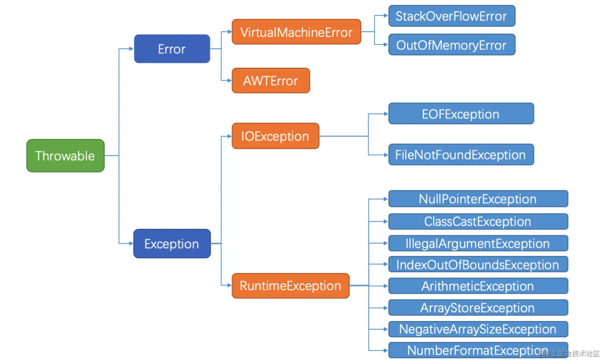
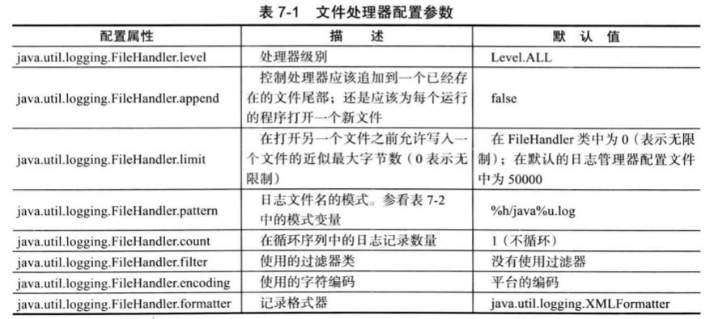
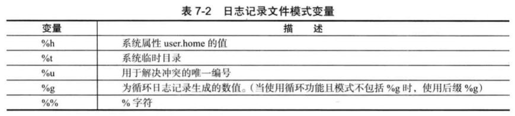
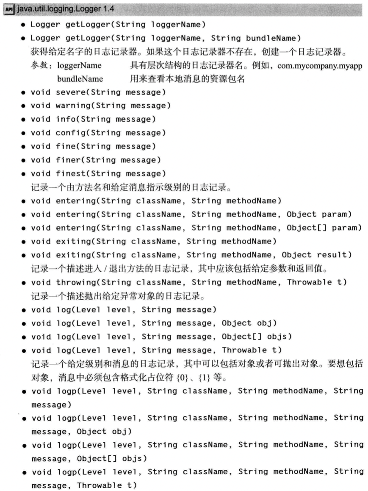
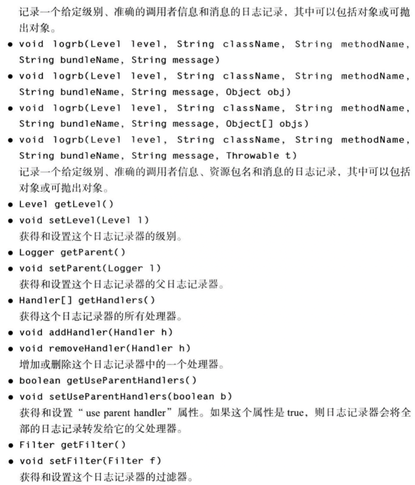
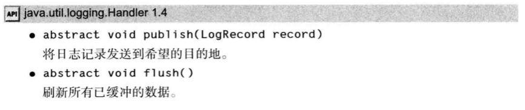
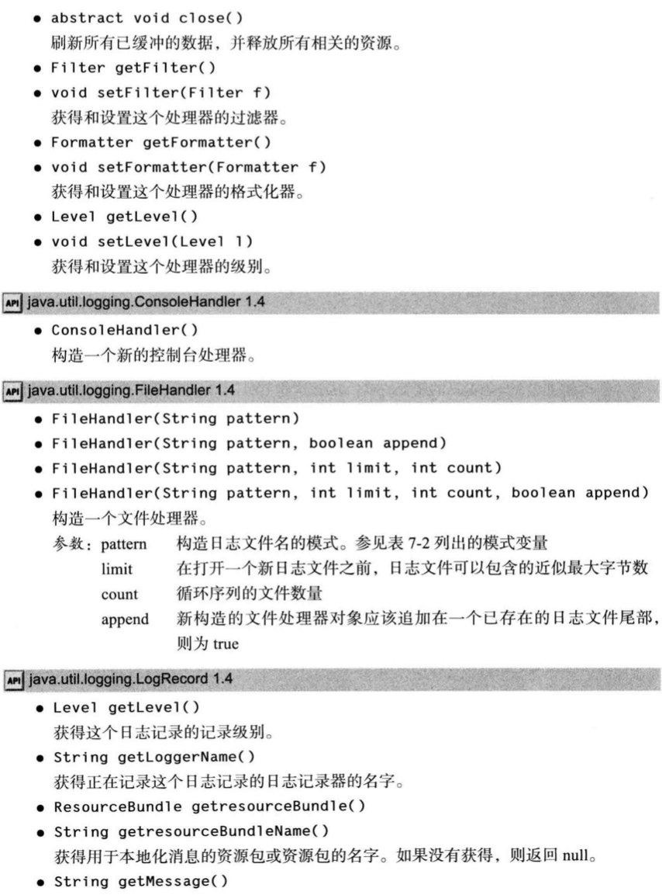
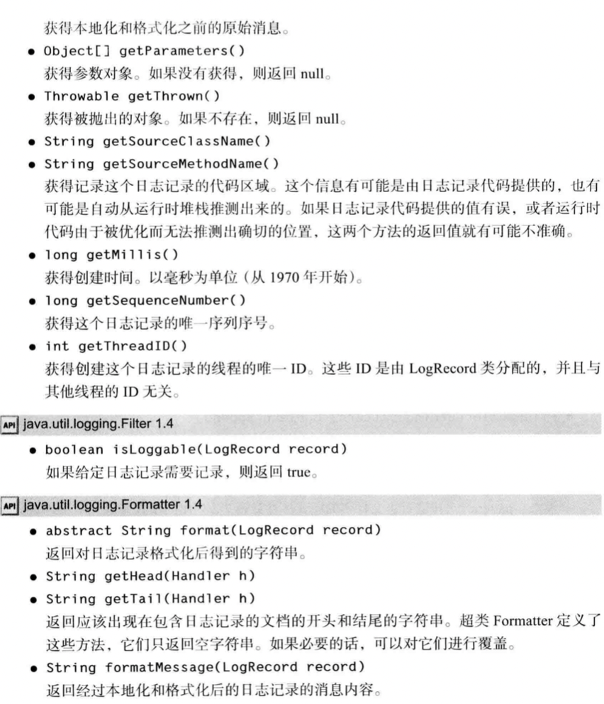
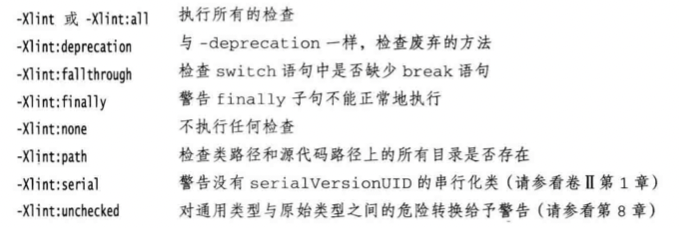

## Section 7  异常、断言和日志

[TOC]

### 7.1 处理错误

在程序出现错误时，用户希望能够用一些理智行为终止，即程序应该：

+  返回到一种安全状态，并能够让用户执行一些其他的命令
+ 允许用户保存所有操作的结果，并以妥善的方式终止程序

**异常处理的任务就是将控制权从错误产生的地方转移给能够处理这种情况的错误处理器。**

哪类问题需要关注：

+ 用户输入错误（输入格式）
+ 设备错误（设备关闭）
+ 物理限制（内存用完）
+ 代码错误

> 如果某个方法不能够采用正常的途径完整它的 任务， 就可以通过另外一个路径退出方法。 在这种情况下， 方法并不返回任何值， 而是抛出 (throw) 一个封装了错误信息的对象。 此外， 调用这个方法的代码也将无法继续执行， 取而代之的是， 异常处理机制开始搜索异常处理器 (exception handler)。

#### 7.1.1 异常分类

在 Java 程序设计语言中， 异常对象都是派生于 Throwable 类的一个实例。 稍后还可以看到， 如果 Java 中内置的异常类不能够满足需求， 用户可以创建自己的异常类。




Error 类描述了 Java 运行时系统的内部错误和资源耗尽错误。如果出现了这样的内部错误，除了通告给用户， 并尽力使程序安全地终止之外，再也无能为力了。这种情况很少出现。

- JVM 内存资源耗尽时出现的 OutOfMemoryError
- 栈溢出时出现的 StackOverFlowError
- 类定义错误 NoClassDefFoundError

Exception: “如果出现 RuntimeException 异常， 那么就一定是你的问题” 是一条相当有道理的规则。

+ RuntimeException：由程序错误导致的异常
  + 错误的类型转换
  + 数组访问越界
  + 访问 null 指针

+ 其他异常：像I/O错误这类问题导致的异常
  + 试图在文件尾部后面读取数据
  + 试图打开一个不存在的文件
  + 试图根据给定的字符串查找 Class 对象， 而这个字符串表示的类并不存在

**Java 语言规范将派生于 Error 类或 RuntimeException 类的所有异常称为非受查 ( unchecked) 异常，所有其他的异常称为受查(checked) 异常。**  这是两个很有用的术语，在后面还会用到。编译器将核查是否为所有的受査异常提供了异常处理器。


#### 7.1.2 声明受查异常

如果遇到了无法处理的情况， 那么 Java 的方法可以抛出一个异常。 

> 一个方法不仅需要告诉编译器将要返回什么值， 还要告诉编译器有可能发生什么错误。 例如， 一段读取文件的代码知道有可能读取的文件不存在，代码就需要通知编译器可能会抛出 IOException 类的异常。

方法应该在其首部声明所有可能抛出的异常，这样可以从首部反映出这个方法可能抛出哪类受査异常。 例如， 下面是标准类库中提供的 FilelnputStream 类的一个构造器的声明：

```java
public Fi1elnputStream(String name) throws FileNotFoundException
```

这个声明表示构造器将根据给定的 String 参数产生一个 FilelnputStream 对象， 但也有可能抛出一个异常。如果发生了这种情况， 构造器将不会初始化，而是抛出一个 FileNotFoundException 类对象， 运行时系统开始搜索异常处理器，来处理此异常。

**记住在遇到下面 4 种情况时应该抛出异常:**

+ 调用一个**抛出**受査异常的方法，例如，FilelnputStream 构造器
+ 程序运行过程中发现错误， 并且利用 throw 语句抛出一个受查异常
+ 程序出现错误
+  Java 虚拟机和运行时库出现的内部错误

如果出现前两种情况之一，则必须告诉调用这个方法的程序员有可能抛出异常。 因为任何一个抛出异常的方法都有可能是一个死亡陷阱。如果没有处理器捕获这个异常，当前执行的线程就会结束。

**注释：不需要声明 Java 的内部错误，即从 Error 继承的错误。任何程序代码都具有抛出那些异常的潜能， 而我们对其没有任何控制能力。同样，也不应该声明从 RuntimeException 继承的那些非受查异常。**

> 这些运行时错误完全在我们的控制之下。如果特别关注数组下标引发的错误， 就应该将更多的时间花费在修正程序中的错误上， 而不是说明这些错误发生的可能性上。

**警告：** 如果在子类中覆盖了超类的一个方法， 子类方法中声明的受查异常不能比超类方法中声明的异常更通用。 特别需要说明的是， 如果超类方法没有抛出任何受查异常， 子类也不能抛出任何受查异常。


#### 7.1.3 如何抛出异常

抛出异常的代码案例：

```java
String readData(Scanner in) throws EOFException{
  ..
  while(...){
    if(!in.hasNext()){
      if(n < len)
      	throw new EOFExeception();
    } // eof encouterd
  }
  return s;
}
```

EOFException 类还有一个含有一个字符串型参数的构造器，这个构造器可以更加细致的 描述异常出现的情况。

```java
String gripe = "Content-length: " + len + ", Received: " + n;
throw new EOFException(gripe);
```

对于一个已经存在的异常类，将其抛出非常容易:

+ 找到一个合适的异常类
+ 创建这个类的一个对象
+ 将对象抛出。


#### 7.1.4 创建异常类

定义一个派生于 IOException 的类。 习惯上， 定义的类应该包含两个构造器， 一个是默认的构造器; 另一个是带有详细描述信息的构造器。

```java
class FileFormatException extends IOException{
  public FileFormatException() {}
  public FileFormatException(String gripe){
    super(gripe);
  }
}

// 现在可以抛出自己定义的异常类型
String readData(BufferReader in) throws FileFormatException{
  ... throw new FileFormatException;
}
```


### 7.2 捕获异常

#### 7.2.1 捕获异常

如果异常没有在任何地方进行捕获， 那程序就会终止执行， 并在控制台上打印出异常信息， 其中包括异常的类型和堆栈的内容。要想捕获一个异常， 必须设置 try/catch 语句块。最简单的 try 语句块如下所示:

```java
try{
  code
}catch(ExceptionType e){
  handle for exception;
}
```

如果在 try 语句块中的任何代码抛出了一个在 catch 子句中说明的异常类， 那么:

+ 程序将跳过 try 语句块的其余代码
+ 程序将执行 catch 子句中的处理器代码

如果在 try 语句块中的代码没有拋出任何异常， 那么程序将跳过 catch 子句。

**通常， 应该捕获那些知道如何处理的异常， 而将那些不知道怎样处理的异常继续进行传递。**


#### 7.2.2 捕获多个异常

在一个 try 语句块中可以捕获多个异常类型， 并对不同类型的异常做出不同的处理。 可以按照下列方式为每个异常类型使用一个单独的 catch 子句:

```java
try{
  code
}catch(FileNotFoundException e){
  handle for exception;
}catch(IOException e){
  handle for exception;
}
// 获取异常信息
e.getMessage();
// 获取实际对象类型
e.getClass().getName();
```

同一个 catch 子句中可以捕获多个异常类型:

```java
try{
  code
}catch(FileNotFoundException | IOException e){
  handle for exception;
}
```


#### 7.2.3 再次抛出异常与异常链

在 catch 子句中可以抛出一个异常， 这样做的目的是改变异常的类型。

如果开发了一个子系统，用于表示子系统故障的异常类型可能会产生多种解释。 ServletException 就是一个异常类型的例子，执行 servlet 的代码可能不想知道发生错误的细节原因， 但希望明确地知道 servlet 是否有问题。下面给出了捕获异常并将它再次抛出的基本方法:

```java
try{
	access the database
}catch(SQLException e){
	throw new ServletException("database error: " + e.getMessage());
}
```

不过，可以有一种更好的处理方法，并且**将原始异常设置为新异常的原因**：

```java
try{
	access the database
}catch(SQLException e){
	Throwable se = new ServletException("database error");
  se.initCause(e);
  throw se;
}
```

当捕获到异常时， 就可以使用下面这条语句重新得到原始异常:

```java
Throwable e = se.getCause();
```

建议使用这种包装技术，这样可以让用户抛出子系统中的高级异常， 而不会丢失原始异常的细节。

> 如果在一个方法中发生了一个受查异常， 而不允许抛出它， 那么包装技术就十分有用；我们可以捕获这个受查异常， 并将它包装成一个运行时异常。


#### 7.2.4 finally子句

代码抛出异常时会终止方法中剩余代码的处理， 并退出执行。 如果方法获得了一些本地资源，这些资源在退出方法之前必须被回收， 就会产生资源回收问题。 

+ 一种解决方案是捕获并重新抛出所有的异常。但是要在两个地方清除所分配的资源(正常代码和异常代码)。 
+ Java 有一种更好的解决方案， 这就是 finally 子句；不管是否有异常被捕获， finally 子句中的代码都被执行。 在下面的示例中， 程序将在所有情况下关闭文件。

```java
InputStream in = new FileInputStream(...);
try{
  code that might cause exception
}catch(IOException e){
  throw error message
}finally{
  in.close();
}
```

**在上面这段代码中，有下列 3 种情况会执行 finally 子句:**

+ 代码没有抛出异常。
+ 抛出一个在catch子句中捕获的异常。
+ 代码抛出了一个异常， 但这个异常不是由 catch 子句捕获的。

事实上， 我们认为在需要关闭资源时， 用这种方式使用 finally 子句是一种不错的选择。

强烈建议解搞合 try/catch 和 try/finally 语句块，这样可以提高代码的清晰度，例如:

```java
InputStrean in = ...; 
try{
  try
  {
    code that might throw exceptions
  }
  finally
  {
    in.close();
  }
}catch(Exception e){
  throw error message
}
```

> 内层的 try 语句块只有一个职责， 就是确保关闭输入流。 外层的 try 语句块也只有一个职责，就是确保报告出现的错误。这种设计方式不仅清楚， 而且还具有一个功能， 就是将会报告 finally 子句中出现的错误。

> 当 finally 子句包含 return 语句时，这个返回值将会覆盖原始的返回值。

**有时候， finally 子句也会带来麻烦。** 例如， try中的方法可能出现异常，清理资源的方法也有可能抛出异常，假设希望能够确保在流处理代码中遇到异常时将流关闭，重新抛出try的异常， 代码会变得极其繁琐。

下一小节将了解到， Java SE 7 中关闭资源的处理会容易得多。


#### 7.2.5 带资源的 try 语句

```java
open a resource
try{
  work with the resource
}
finally{
  close the resource
}
```

假设资源属于一个实现了 AutoCloseable 接口的类， AutoCloseable 接口有一个方法:

```
void close() throws Exception
```

> 另外，还有一个Closeable接口，这是AutoCloseable的子接口，也包含一个close 方法。 不过，这个方法声明为抛出一个IOException。

**带资源的try语句(try-with-resources) 的最简形式为:**

```java
try(Resource res = ...){
  work with res
}
```

try 块退出时，会自动调用 res.close()，可以指定多个资源 。 下面给出一个典型的例子，这里要读取一个文件中的所有单词:

```java
try (Scanner in = new Scanner(new FileInputStream("/usr/share/dict/words"),"UTF-8");
                             PrintWriter out = new PrintWriter("out.txt"))
 {
	while (in.hasNext()){
		System.out.println(in.next());
	}
}
```

**这个块正常退出时， 或者存在一个异常时， 都会调用 in.close()和out.close()方法， 就像用 finally 。**


#### 7.2.6 分析堆栈轨迹元素

堆栈轨迹(stack trace ) 是一个方法调用过程的列表， 它包含了程序执行过程中方法调用的特定位置。当 Java 程序正常终止，而没有捕获异常时，这个列表就会显示出来。

可以调用 Throwable 类的 printStackTrace 方法访问堆栈轨迹的文本描述信息。

```java
Throwable t = new Throwable(); 
StringWriter out = new StringWriter(); 
t.printStackTrace(new PrintWriter(out)); 
String description = out.toString();
```

一种更灵活的方法是使用 getStackTrace 方法， 它会得到 StackTraceElement 对象的一个数组， 可以在你的程序中分析这个对象数组。 例如:

```java
Throwable t = new Throwable();
StackTraceElement[] frames = t.getStackTrace();
for (StackTraceElement frame : frames)
  analyze frame
```

静态的 Thread.getAllStackTrace 方法， 它可以产生所有线程的堆栈轨迹:

```java
Map<Thread, StackTraceElement[]> map = Thread.getAl1StackTraces();
for(Thread t : map.keySet()){
  StackTraceElement[] frames = map.get(t);
  analyze frame
}
```


### 7.3 使用异常机制的技巧

下面给出使用异常机制的几个技巧：

+ 异常处理不能代替简单的测试，只在异常情况下使用异常机制。
+ 不要过分地细化异常
+ 利用异常层次结构（不要只抛出 RuntimeException 异常，应该寻找更加适当的子类或创建自己的异常类；不要只捕获 Thowable 异常， 否则， 会使程序代码更难读、更难维护。）
+ 不要压制异常
+ 在检测错误时，“苛刻”要比放任更好
+ 不要羞于传递异常


### 7.4 使用断言

#### 7.4.1 断言的概念

假设确信某个属性符合要求， 并且代码的执行依赖于这个属性。断言机制允许在测试期间向代码中插入一些检査语句；当代码发布时， 这些插入的检测语句将会被自动地移走。

Java 语言引人了关键字 assert 这个关键字有两种形式:

+ assert 条件
+ assert 条件:表达式

这两种形式都会对条件进行检测， 如果结果为 false, 则抛出一个 AssertionError 异常。 在第二种形式中， 表达式将被传人 AssertionError 的构造器， 并转换成一个消息字符串。

>  表达式” 部分的唯一目的是产生一个消息字符串。 AssertionError 对象并不存储表达式的值， 因此， 不可能在以后得到它。

要想断言 x 是一个非负数值， 只需要简单地使用下面这条语句：

```java
assert x >= 0;
```

或者将 x 的实际值传递给 AssertionError 对象， 从而可以在后面显示出来:

```java
assert x >= 0 : x;
assert x >= 0 : “x >= 0”
```


#### 7.4.2 启用和禁用断言

在默认情况下， 断言被禁用。可以在运行程序时用 -enableassertions 或 -ea 选项启用:

```
java -enableassertions MyApp
```

也可以在某个类或整个包中使用断言， 例如:

```
 java -ea:MyClass -eaiconi.inycompany.inylib ... MyApp
```

需要注意的是，在启用或禁用断言时不必重新编译程序，启用或禁用断言是类加载器 ( class loader ) 的功能。当断言被禁用时，类加载器将跳过断言代码，因此，不会降低程序运行的速度。


#### 7.4.3 使用断言完成参数检查

在 Java 语言中， 给出了 3 种处理系统错误的机制:

+ 出一个异常
+ 日志
+ 使用断言

什么时候应该选择使用断言呢? 请记住下面几点:

+ 断言失败是致命的、 不可恢复的错误
+ 断言检查只用于开发和测阶段

因此， 不应该使用断言向程序的其他部分通告发生了可恢复性的错误， 或者，不应该作为程序向用户通告问题的手段，断言只应该用于在测试阶段确定程序内部的错误位置。


#### 7.4.4 为文档假设使用断言

无论如何， 断言是一种测试和调试阶段所使用的战术性工具; 而日志记录是一种在程序的整个生命周期都可使用的策略性工具。 下一节将介绍日志的相关知识。


### 7.5 记录日志

> 每个 Java 程序员都很熟悉在有问题的代码中插入一些 System.out.println 方法调用来帮助观察程序运行的操作过程。 当然， 一旦发现问题的根源，就要将这些语句从代码中删去。如果接下来又出现了问题， 就需要再插入几个调用 System.out.println 方法的语句。 记录日志 API 就是为了解决这个问题而设计的。 

下面先讨论这些 API 的优点:

+ 可以很容易地取消全部日志记录，或者仅仅取消某个级别的日志，而且打开和关闭这个操作也很容易。
+ 可以很简单地禁止日志记录的输出，因此，将这些日志代码留在程序中的开销很小。
+ 日志记录可以被定向到不同的处理器，用于在控制台中显示，用于存储在文件中等。
+ 日志记录器和处理器可以对记录进行过滤，根据过滤实现器制定的标准丢弃那些无用的记录项。
+ 日志记录可以采用不同的方式格式化， 例如， 纯文本或 XML
+ 应用程序可以使用多个日志记录器， 它们使用类似包名的这种具有层次结构的名字
+ 在默认情况下， 日志系统的配置由配置文件控制。 如果需要的话， 应用程序可以替换这个配置。


#### 7.5.1 基本日志

生成简单的日志记录， 可以使用全局日志记录器(global logger) 并调用其 info 方法:

```java
Logger.getGlobal().info("File->Open menu item selected");
```

在默认情况下， 这条记录将会显示以下内容:

```java
May 10, 2013 10:12:15 PM LogginglmageViewer fileOpen 
INFO: File->open menu item selected
```

但是， 如果在适当的地方(如 main 开始)调用:

```java
Logger.getGlobal().setLevel(Level.OFF) ;
```


#### 7.5.2 高级日志

在一 个专业的应用程序中，不要将所有的日志都记录到一个全局日志记录器中，而是可以自定义日志记录器。

可以调用 getLogger 方法创建或获取记录器:

```java
private static final Logger myLogger = Logger.getLogger("com.mycompany.myapp"):
```

> 未被任何变量引用的日志记录器可能会被垃圾回收。 为了防止这种情况发生，要像上面的例子中一样，用一个静态变量存储日志记录器的一个引用。

**与包名相比， 日志记录器的层次性更强。** 对于包来说， 一个包的名字与其父包的名字之间没有语义关系，但是日志记录器的父与子之间将**共享某些属性**。 例如，如果对 com.mycompany 日志记录器设置了日志级别， 它的子记录器也会继承这个级别。

**通常，有以下 7 个日志记录器级别:**

+ SEVERE
+ WARNING  
+ INFO
+ CONFIG 
+ FINE
+ FINER
+ FINEST

在默认情况下， 只记录前三个级别。 也可以设置其他的级別。 例如：

```java
logger.setLevel(Level.FINE);
```

现在，FINE和更高级别的记录都可以记录下来。另外，还可以使用 Level.ALL 开启所有级别的记录，或者使用 Level.OFF 关闭所有级别的记录。**对于所有的级别有下面几种记录方法:**

```java
logger.warning(message);
logger.fine(message);
```

同时， 还可以使用 log 方法指定级别， 例如: 

```
logger.log(Level.FINE, message);
```

> 默认的日志配置记录了 INFO 或更高级别的所有记录， 因此，应该使用 CONFIG、FINE、FINER和FINEST级别来记录那些有助于诊断，但对于程序员又没有太大意义的调试信息。

>  如果将记录级别设计为 INFO 或者更低， 则需要修改日志处理器的配置。

**默认的日志记录将显示包含日志调用的类名和方法名， 如同堆栈所显示的那样。但是，如果虚拟机对执行过程进行了优化，就得不到准确的调用信息。** 此时，可以调用 logp 方法获得调用类和方法的确切位置， 这个方法的签名为:

```java
void logp(Level 1, String className, String methodName, String message)
```

下面有一些用来跟踪执行流的方法:

```
void entering(String dassName, String methodName)
void enteringCString className, String methodName, Object param) 
void entering(String className, String methodName, Object[] params)
void exiting(String className, String methodName)
void exiting(String className, String methodName, Object result)
```

使用实例：

```java
int read(String file, String pattern){
  1ogger.entering("com.mycompany.mylib.Reader","read",new Object[]{ file, pattern });
  ...
  1ogger.exiting("com.mycompany.mylib.Reader", "read", count): 
  return count;
}
```

这些调用将生成 FINER 级别和以字符串 ENTRY 和 RETURN 开始的日志记录。

**记录日志的常见用途是记录那些不可预料的异常，可以使用下面两个方法提供日志记录中包含的异常描述内容。**

```
void throwing(String className, String methodName, Throwable t) 
void log(Level 1, String message, Throwable t)
```

典型的用法是:

```java
if(...){
	IOException exception = new IOException("...");
	1ogger.throwing("com.mycompany.mylib.Reader", "read", exception);
	throw exception;
}
```

以及

```java
try{
  ...
}
catch (IOException e){
	Logger.getLogger("com.mycompany.myapp").log(Level.WARNING, "Reading image", e);
}
```

**调用 throwing 可以记录一条 FINER 级别的记录和一条以 THROW 开始的信息。**


#### 7.5.3 修改日志管理器配置

可以通过编辑配置文件来修改日志系统的各种属性。在默认情况下， 配置文件存在于:

```
jre/lib/1ogging.properties
```

要想使用另一个配置文件，就要将 java.utiUogging.config.file 特性设置为配置文件的存储位置， 并用下列命令启动应用程序:

```
java -D java.util.logging.config.file=configFileMainClass
```

> 日志管理器在 VM 启动过程中初始化， 这在 main 执行之前完成。 如果在 main 中调用 `System.setProperty("java.util.logging.config.file"，file)`, 也会调用 LogManager. readConfiguration() 来重新初始化日志管理器

要想修改默认的日志记录级别， 就需要编辑配置文件， 并修改以下命令行

```
.level=INFO
```

可以通过添加以下内容来指定自己的日志记录级别

```
com.mycompany.myapp.level=FINE
```

也就是说， 在日志记录器名后面添加后缀 .level。

在稍后可以看到， 日志记录并不将消息发送到控制台上，这是处理器的任务。 要想在控制台上看到 FINE 级别的消息， 就需要进行下列设置:

```
java.util.logging.ConsoleHandler.level=FINE
```


#### 7.5.4 本地化

我们可能希望将日志消息本地化， 以便让全球的用户都可以阅读它，下面简要地说明一下在本地化日志消息时需要牢记的一些要点。

本地化的应用程序包含资源包(resource bundle) 中的本地特定信息，资源包由各个地区 ( 如美国或德国)的映射集合组成。 例如， 某个资源包可能将字符串“ readingFile” 映射成英文的 “ Reading file ” 或者德文的“ Achtung! Datei wird eingelesen ”。

一个程序可以包含多个资源包，每个资源包都有一个名字(如 com.mycompany.logmessages)。要想将映射添加到一个资源包中， 需要为每个地区创建一个文件。英文消息映射位于 `com/mycompany/logmessages_en.properties` 文件中。

可以将这些文件与应用程序的类文件放在一起， 以便 ResourceBimdle 类自动地对它们进行定位。这些文件都是纯文本文件， 其组成如下所示:

```
readingFile=Achtung! Datei wird eingelesen 
renamingFile=Datei wird umbenannt
...
```

在请求日志记录器时， 可以指定一个资源包:

```java
Logger logger = Logger.getLogger(loggerName, "com.mycompany.1ogmessages");
```

然后， 为日志消息指定资源包的关键字， 而不是实际的日志消息字符串。

```
logger.info("readingFi1e");
```

通常需要在本地化的消息中增加一些参数，消息应该包括占位符 {0} 、{1} 等。例如，要想在日志消息中包含文件名， 就应该用下列方式包括占位符:

```java
Reading file {0}.
Achtung! Datei {0} wird eingelesen.
```

然后， 通过调用下面的一个方法向占位符传递具体的值:

```
logger.log(Level.INFO, "readingFile", fileName); 
logger.log(Level.INFO,"renamingFile", newObject[]{oldName, newName});
```


#### 7.5.5 处理器

在默认情况下，**日志记录器**将记录发送到 ConsoleHandler 中， 并由它输出到 System.err 流中。特别是，日志记录器还会将记录发送到**父处理器**中，而最终的处理器有一个 ConsoleHandler 。

与日志记录器一样， 处理器也有日志记录级别。**对于一个要被记录的日志记录， 它的日志记录级别必须高于日志记录器和处理器的阈值。** 日志管理器配置文件设置的默认控制台处理器的日志记录级别为：

```
java.uti1.1ogging.ConsoleHandler.level = INF0
```

要想记录 FINE 级别的日志，就必须修改配置文件中的默认日志记录级别和处理器级别。 另外，还可以绕过配置文件，安装自己的处理器：

```java
Logger logger = Logger.getLogger("com.mycompany.myapp"); 
logger.setLevel(Level.FINE);
1ogger.setUseParentHandlers(false);

Handler handler = new ConsoleHandler();
handler.setLevel(Level.FINE); 
logger.addHandler(hander):
```

>  **在默认情况下， 日志记录器将记录发送到自己的处理器和父处理器(2次)。** 我们的日志记录器是原始日志记录器 (命名为" ") 的子类， 而原始日志记录器将会把所有等于或高于 INFO 级別的记录发送到控制台。然而， 我们并不想两次看到这些记录。鉴于这个原因， 应该将 UseParentHandlers 设置为 false。

要想将日志记录发送到其他地方，就要添加其他的处理器。日志 API 为此提供了两个很有用的处理器，一个是 FileHandler ; 另一个是 SocketHandle。SocketHandler 将记录发送到特定的主机和端口；而更令人感兴趣的是 FileHandler, 它可以收集文件中的记录。

**可以像下面这样直接将记录发送到默认文件的处理器:**

```java
FileHandler handler = new FileHandler();
1ogger.addHandler(handler);
```

这些记录被发送到用户主目录的 javan.log 文件中， n 是文件名的唯一编号。 在默认情况下,记录被格式化为 XML。

可以通过设置日志管理器配置文件中的不同参数，或者利用其他的构造器来修改文件处理器的默认行为。



也有可能不想使用默认的日志记录文件名， 因此， 应该使用另一种模式， 例如， %h/ myapp.log ( 有关模式变量的解释请参看表 7-2)



如果多个应用程序(或者同一个应用程序的多个副本)使用同一个口志文件， **就应该开启 append 标志**。另外， 应该在文件名模式中使用 %u, 以便每个应用程序创建日志的唯一副本。

开启文件循环功能也是一个不错的主意。日志文件以myapp.log.0, myapp.log.1, myapp. log.2, 这种循环序列的形式出现。只要文件超出了大小限制， 最旧的文件就会被删除， 其他的文件将重新命名， 同时创建一个新文件， 其编号为 0。

> 很多程序员将曰志记录作为辅助文档提供给技术支持员工。 如果程序的行为有误， 用户就可以返回查看日志文件以找到错误的原因， 在这种情况下， 应该开启“ append” 标志， 或使用循环日志， 也可以两个功能同时使用 .


#### 7.5.6 过滤器

**在默认情况下， 过滤器根据日志记录的级别进行过滤。** 每个日志记录器和处理器都可以有一个可选的过滤器来完成附加的过滤。 另外， 可以通过实现 Filter 接口并定义下列方法来自定义过滤器。

```
boolean isLoggab1e(LogRecord record)
```

在这个方法中， 可以利用自己喜欢的标准， 对日志记录进行分析， 返回 true 表示这些记录应该包含在日志中。 例如， 某个过滤器可能只对 entering 方法和 exiting 方法产生的消息感兴趣，这个过滤器可以调用 record.getMessage() 方法， 并査看这个消息是否用 ENTRY 或 RETURN 开头。

要想将一个过滤器安装到一个日志记录器或处理器中， 只需要调用 setFilter 方法就可以了。注意， 同一时刻最多只能有一个过滤器。


#### 7.5.7 格式化器

ConsoleHandler 类和 FileHandler 类可以生成文本和 XML 格式的日志记录。 但是， 也可以自定义格式。 这需要扩展 Formatter 类并覆盖下面这个方法:

```
String format(LogRecord record)
```

可以根据自己的愿望对记录中的信息进行格式化， 并返回结果字符串。 在 format 方法中， 有可能会调用下面这个方法：

```
String formatMessage(LogRecord record)
```

这个方法对记录中的部分消息进行格式化、 参数替换和本地化应用操作。

很多文件格式(如 XML) 需要在已格式化的记录的前后加上一个头部和尾部在这个例子中， 要覆盖下面两个方法:

```
String getHead(Handler h) 
String getTail(Handler h)
```

最后， 调用 setFormatter 方法将格式化器安装到处理器中。


#### 7.5.8 日志记录说明

面对日志记录如此之多的可选项，很容易让人忘记最基本的东西。**下面的总结了一些最常用的操作：**

1）为一个简单的应用程序， 选择一个日志记录器， 并把日志记录器命名为与主应用程序包一样的名字（例如，com.mycompany.myprog ），是一种好的编程习惯。**通过调用下列方法创建日志记录器：**

```
Logger logger = Logger.getLogger("com.mycompany.myprog");
```

为了方便起见， 可能希望利用一些日志操作将下面的静态域添加到类中:

```java
private static final Logger logger = Logger.getLogger("com.mycompany.nyprog"):
```

2）默认的日志配置将级别等于或高于 INFO 级别的所有消息记录到控制台。用户可以覆盖默认的配置文件。 但是 改变配置需要做相当多的工作。 **因此， 最好在应用程序中安装一个更加适宜的默认配置。**

下列代码**确保将所有的消息记录到应用程序特定的文件中**, 可以将这段代码放置在应用程序的 main 方法中。

```java
if (System.getProperty("java,util.logging.config.class") == null && System.getProperty("java.util.logging.config.file") == null){
  try{
    Logger.getLogger("").setLevel(Level.ALL);
    final int LOG_ROTATION_COUNT = 10;
    Handler handler = new FileHandler('%h/myapp.log", 0, L0G_R0TATI0N_C0UNT);
    Logger.getLogger("").addHandler(handler);
  }
  catch (IOExcption e){
    logger.log(Level.SEVERE,"can't create log file handler",e);
  }
}
```

3）需要牢记: 所有级别为 INFO、 WARNING 和 SEVERE 的消息都将显示到控制台上。因此， 最好只将对程序用户有意义的消息设置为这几个级别。将程序员其他想要的日志记录， 设定为 FINE 是一个很好的选择。

当调用 System.out.println 时， 实际上生成了下面的日志消息:

```java
logger.fine("File open dialog canceled");
```

记录那些不可预料的异常也是一个不错的想法， 例如:

```java
try{
...
}catch(Exception e){
  logger.log(Level.FINE, "explanation", e);
}
```












### 7.6 调试技巧

假设编写了一个程序，并对所有的异常进行捕获和恰当的处理，然后运行程序还是出现了错误，这时候就需要用到调试：

+ 可以用下面的方法打印或记录任意变量的值:

```
System.out.println("x=" + x);
Logger.getGlobal().info("x=" + x);
```

+ 一个不太为人所知但却非常有效的技巧是在每一个类中放置一个单独的 main 方法，对每一个类进行单元测试。利用这种技巧， 只需要创建少量的对象， 调用所有的方法， 并检测每个方法是否能够正确地运行就可以了。
+ Junit是一个非常常见的单元测试框架， 利用它可以很容易地组织测试用例套件。 
+ 日志代理 (logging proxy) 是一个子类的对象， 它可以截获方法调用，并进行日志记录，然后调用超类中的方法。 **例如， 如果在调用 Random 类的 nextDouble 方法时出现了问题， 就可以按照下面的方式， 以匿名子类实例的形式创建一个代理对象:**

```java
Random generator = new Random(){
  public double nextDouble(){
    double result = super.nextDouble();
    Logger.getglobal().info("nextDouble: " + result);
  	return result;
  }
}
```

当调用 nextDouble 方法时， 就会产生一个日志消息；要想知道谁调用了这个方法， 就要生成一个堆栈轨迹。

+ 利用 Throwable 类提供的 printStackTrace 方法， 可以从任何一个异常对象中获得堆栈情况。下面的代码将捕获任何异常， 打印异常对象和堆栈轨迹， 然后， 重新拋出异常， 以便 能够找到相应的处理器。

```java
try{
  ...
}catch(Throwable t){
  t.printStackTrace();
  throw t;
}
```

不一定要通过捕获异常来生成堆栈轨迹。 只要在代码的任何位置插入下面这条语句就可以获得堆栈轨迹:

```
Thread.duapStack():
```

+ —般来说， 堆栈轨迹显示在 System.err 上。也可以利用 printStackTrace(PrintWriter s) 方法将它发送到一个文件中。另外，可以采用下面的方式， 将它捕获到一个字符串中。

```java
StringWriter out = new StringWriter();
new Throwable().printStackTrace(new PrintWriter(out)); // 发送到一个out文件中
String description = out.toString(); // 将它捕获到一个字符串中
```

+ 通常， 将一个程序中的错误信息保存在一个文件中是非常有用的。 然而， 错误信息被发送到 System.err 中， 而不是 System.out 中。 因此， 不能够通过运行下面的语句获取它们:

```
java MyProgram > errors.txt
```

而是采用下面的方式捕获错误流:

```
java MyProgram 2> errors.txt
```

要想在同一个文件中同时捕获 System.err 和 System.out, 需要使用下面这条命令:

```
java MyProgram 1> errors.txt 2>&1
```

+ 非捕获异常的堆栈轨迹出现在 System.err 中并不是一个很理想的方法。 如果在客户端偶然看到这些消息， 则会感到迷惑， 并且在需要的时候也无法实现诊断目的。 比较好的方式是将这些内容记录到一个文件中。可以调用静态的`Thread.setDefaultUncaughtExceptionHandler`方法改变**非捕获异常**的处理器:

```java
Thread.setDefaultUncaughtExceptionHandler(
	new Thread.UncaughtExceptionHandler(){
    public void uncaughtException(Thread t,Throwable e){
      save information in log file
    }
  };
);
```

+ 要想观察类的加载过程， 可以用 -verbose 标志启动 Java 虚拟机。有时候， 这种方法有助于诊断由于类路径引发的问题。 这样就可以看到如下所示的输出结果:

```
[Opened /usr/local/jdk5•0/jre/1ib/rt• ar]
[Opened /usr/local/jdk5.0/jre/lib/jsse.jar]
[Opened /usr/local/jdk5.0/jre/lib/jce.jar]
[Opened /usr/local/jdk5.0/jre/1ib/charsets.jar]
[Loaded java.lang.Object from shared objects file]
[Loaded java.io.Serializable from shared objects file]
[Loaded java.lang.Comparable from shared objects file]
[Loaded java.lang.CharSequence from shared objects file]
...
```

+ -Xlint 选项告诉编译器对一些普遍容易出现的代码问题进行检査。 例如， 如果使用下面这条命令编译:

```
javac -Xlint:fallthrough
```

当 switch 语句中缺少 break 语句时， 编译器就会给出报告。下面列出了可以使用的选项:



+ java 虚拟机增加了对 Java 应用程序进行监控(monitoring) 和管理(management) 的 支持。它允许利用虚拟机中的代理装置跟踪内存消耗、 线程使用、类加载等情况。 这个功能 对于像应用程序服务器这样大型的、长时间运行的 Java 程序来说特别重要。

+ 可以使用 jmap 实用工具获得一个堆的转储， 其中显示了堆中的每个对象。 
+ 如果使用 -Xprof 标志运行 Java 虚拟机， 就会运行一个基本的剖析器来跟踪那些代码中经常被调用的方法。

