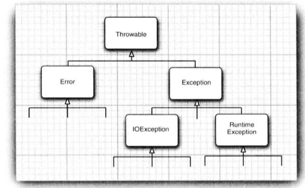

## Section 7  异常、断言和日志

[TOC]

### 7.1 处理错误

在程序出现错误时，用户希望能够用一些理智行为终止，即程序应该：

+  返回到一种安全状态，并能够让用户执行一些其他的命令
+ 允许用户保存所有操作的结果，并以妥善的方式终止程序

**异常处理的任务就是将控制权从错误产生的地方转移给能够处理这种情况的错误处理器。**

哪类问题需要关注：

+ 用户输入错误（输入格式）
+ 设备错误（设备关闭）
+ 物理限制（内存用完）
+ 代码错误

> 如果某个方法不能够采用正常的途径完整它的 任务， 就可以通过另外一个路径退出方法。 在这种情况下， 方法并不返回任何值， 而是抛出 (throw) 一个封装了错误信息的对象。 此外， 调用这个方法的代码也将无法继续执行， 取而代之的是， 异常处理机制开始搜索异常处理器 (exception handler)。

#### 7.1.1 异常分类

在 Java 程序设计语言中， 异常对象都是派生于 Throwable 类的一个实例。 稍后还可以看到， 如果 Java 中内置的异常类不能够满足需求， 用户可以创建自己的异常类。



> Error 类描述了 Java 运行时系统的内部错误和资源耗尽错误。如果出现了这样的内部错误，除了通告给用户， 并尽力使程序安全地终止之外，再也无能为力了。这种情况很少出现。

Exception: “如果出现 RuntimeException 异常， 那么就一定是你的问题” 是一条相当有道理的规则。

+ RuntimeException：由程序错误导致的异常
  + 错误的类型转换
  + 数组访问越界
  + 访问 null 指针

+ 其他异常：像I/O错误这类问题导致的异常
  + 试图在文件尾部后面读取数据
  + 试图打开一个不存在的文件
  + 试图根据给定的字符串查找 Class 对象， 而这个字符串表示的类并不存在

**Java 语言规范将派生于 Error 类或 RuntimeException 类的所有异常称为非受查 ( unchecked) 异常，所有其他的异常称为受查(checked) 异常。**这是两个很有用的术语，在后面还会用到。编译器将核查是否为所有的受査异常提供了异常处理器。


#### 7.1.2 声明受查异常

如果遇到了无法处理的情况， 那么 Java 的方法可以抛出一个异常。 

> 一个方法不仅需要告诉编译器将要返回什么值， 还要告诉编译器有可能发生什么错误。 例如， 一段读取文件的代码知道有可能读取的文件不存在，代码就需要通知编译器可能会抛出 IOException 类的异常。

方法应该在其首部声明所有可能抛出的异常，这样可以从首部反映出这个方法可能抛出哪类受査异常。 例如， 下面是标准类库中提供的 FilelnputStream 类的一个构造器的声明：

```java
public Fi1elnputStream(String name) throws FileNotFoundException
```

这个声明表示构造器将根据给定的 String 参数产生一个 FilelnputStream 对象， 但也有可能抛出一个异常。如果发生了这种情况， 构造器将不会初始化，而是抛出一个 FileNotFoundException 类对象， 运行时系统开始搜索异常处理器，来处理此异常。

**记住在遇到下面 4 种情况时应该抛出异常:**

+ 调用一个**抛出**受査异常的方法，例如，FilelnputStream 构造器
+ 程序运行过程中发现错误， 并且利用 throw 语句抛出一个受查异常
+ 程序出现错误
+  Java 虚拟机和运行时库出现的内部错误

如果出现前两种情况之一，则必须告诉调用这个方法的程序员有可能抛出异常。 因为任何一个抛出异常的方法都有可能是一个死亡陷阱。如果没有处理器捕获这个异常，当前执行的线程就会结束。

**注释：不需要声明 Java 的内部错误，即从 Error 继承的错误。任何程序代码都具有抛出那些异常的潜能， 而我们对其没有任何控制能力。同样，也不应该声明从 RuntimeException 继承的那些非受查异常。**

> 这些运行时错误完全在我们的控制之下。如果特别关注数组下标引发的错误， 就应该将更多的时间花费在修正程序中的错误上， 而不是说明这些错误发生的可能性上。

**警告：**如果在子类中覆盖了超类的一个方法， 子类方法中声明的受查异常不能比超类方法中声明的异常更通用。 特别需要说明的是， 如果超类方法没有抛出任何受查异常， 子类也不能抛出任何受查异常。


#### 7.1.3 如何抛出异常

抛出异常的代码案例：

```java
String readData(Scanner in) throws EOFException{
  ..
  while(...){
    if(!in.hasNext()){
      if(n < len)
      	throw new EOFExeception();
    } // eof encouterd
  }
  return s;
}
```

EOFException 类还有一个含有一个字符串型参数的构造器，这个构造器可以更加细致的 描述异常出现的情况。

```java
String gripe = "Content-length: " + len + ", Received: " + n;
throw new EOFException(gripe);
```

对于一个已经存在的异常类，将其抛出非常容易:

+ 找到一个合适的异常类
+ 创建这个类的一个对象
+ 将对象抛出。


#### 7.1.4 创建异常类

定义一个派生于 IOException 的类。 习惯上， 定义的类应该包含两个构造器， 一个是默认的构造器; 另一个是带有详细描述信息的构造器。

```java
class FileFormatException extends IOException{
  public FileFormatException() {}
  public FileFormatException(String gripe){
    super(gripe);
  }
}

// 现在可以抛出自己定义的异常类型
String readData(BufferReader in) throws FileFormatException{
  ... throw new FileFormatException;
}
```


### 7.2 捕获异常

#### 7.2.1 捕获异常

如果异常没有在任何地方进行捕获， 那程序就会终止执行， 并在控制台上打印出异常信息， 其中包括异常的类型和堆栈的内容。要想捕获一个异常， 必须设置 try/catch 语句块。最简单的 try 语句块如下所示:

```java
try{
  code
}catch(ExceptionType e){
  handle for exception;
}
```

如果在 try 语句块中的任何代码抛出了一个在 catch 子句中说明的异常类， 那么:

+ 程序将跳过 try 语句块的其余代码
+ 程序将执行 catch 子句中的处理器代码

如果在 try 语句块中的代码没有拋出任何异常， 那么程序将跳过 catch 子句。

**通常， 应该捕获那些知道如何处理的异常， 而将那些不知道怎样处理的异常继续进行传递。**


#### 7.2.2 捕获多个异常

在一个 try 语句块中可以捕获多个异常类型， 并对不同类型的异常做出不同的处理。 可以按照下列方式为每个异常类型使用一个单独的 catch 子句:

```java
try{
  code
}catch(FileNotFoundException e){
  handle for exception;
}catch(IOException e){
  handle for exception;
}
// 获取异常信息
e.getMessage();
// 获取实际对象类型
e.getClass().getName();
```

同一个 catch 子句中可以捕获多个异常类型:

```java
try{
  code
}catch(FileNotFoundException | IOException e){
  handle for exception;
}
```


#### 7.2.3 再次抛出异常与异常链

在 catch 子句中可以抛出一个异常， 这样做的目的是改变异常的类型。

如果开发了一个子系统，用于表示子系统故障的异常类型可能会产生多种解释。 ServletException 就是一个异常类型的例子，执行 servlet 的代码可能不想知道发生错误的细节原因， 但希望明确地知道 servlet 是否有问题。下面给出了捕获异常并将它再次抛出的基本方法:

```java
try{
	access the database
}catch(SQLException e){
	throw new ServletException("database error: " + e.getMessage());
}
```

不过，可以有一种更好的处理方法，并且**将原始异常设置为新异常的原因**：

```java
try{
	access the database
}catch(SQLException e){
	Throwable se = new ServletException("database error");
  se.initCause(e);
  throw se;
}
```

当捕获到异常时， 就可以使用下面这条语句重新得到原始异常:

```java
Throwable e = se.getCause();
```

建议使用这种包装技术，这样可以让用户抛出子系统中的高级异常， 而不会丢失原始异常的细节。

> 如果在一个方法中发生了一个受查异常， 而不允许抛出它， 那么包装技术就十分有用；我们可以捕获这个受查异常， 并将它包装成一个运行时异常。


#### 7.2.4 finally子句

代码抛出异常时会终止方法中剩余代码的处理， 并退出执行。 如果方法获得了一些本地资源，这些资源在退出方法之前必须被回收， 就会产生资源回收问题。 

+ 一种解决方案是捕获并重新抛出所有的异常。但是要在两个地方清除所分配的资源(正常代码和异常代码)。 
+ Java 有一种更好的解决方案， 这就是 finally 子句；不管是否有异常被捕获， finally 子句中的代码都被执行。 在下面的示例中， 程序将在所有情况下关闭文件。

```java
InputStream in = new FileInputStream(...);
try{
  code that might cause exception
}catch(IOException e){
  throw error message
}finally{
  in.close();
}
```

**在上面这段代码中，有下列 3 种情况会执行 finally 子句:**

+ 代码没有抛出异常。
+ 抛出一个在catch子句中捕获的异常。
+ 代码抛出了一个异常， 但这个异常不是由 catch 子句捕获的。

事实上， 我们认为在需要关闭资源时， 用这种方式使用 finally 子句是一种不错的选择。

强烈建议解搞合 try/catch 和 try/finally 语句块，这样可以提高代码的清晰度，例如:

```java
InputStrean in = ...; 
try{
  try
  {
    code that might throw exceptions
  }
  finally
  {
    in.close();
  }
}catch(Exception e){
  throw error message
}
```

> 内层的 try 语句块只有一个职责， 就是确保关闭输入流。 外层的 try 语句块也只有一个职责，就是确保报告出现的错误。这种设计方式不仅清楚， 而且还具有一个功能， 就是将会报告 finally 子句中出现的错误。

> 当 finally 子句包含 return 语句时，这个返回值将会覆盖原始的返回值。

**有时候， finally 子句也会带来麻烦。** 例如， try中的方法可能出现异常，清理资源的方法也有可能抛出异常，假设希望能够确保在流处理代码中遇到异常时将流关闭，重新抛出try的异常， 代码会变得极其繁琐。

下一小节将了解到， Java SE 7 中关闭资源的处理会容易得多。


#### 7.2.5 带资源的 try 语句

```java
open a resource
try{
  work with the resource
}
finally{
  close the resource
}
```

假设资源属于一个实现了 AutoCloseable 接口的类， AutoCloseable 接口有一个方法:

```
void close() throws Exception
```

> 另外，还有一个Closeable接口，这是AutoCloseable的子接口，也包含一个close 方法。 不过，这个方法声明为抛出一个IOException。

**带资源的try语句(try-with-resources) 的最简形式为:**

```java
try(Resource res = ...){
  work with res
}
```

try 块退出时，会自动调用 res.close()，可以指定多个资源 。 下面给出一个典型的例子，这里要读取一个文件中的所有单词:

```java
try (Scanner in = new Scanner(new FileInputStream("/usr/share/dict/words"),"UTF-8");
                             PrintWriter out = new PrintWriter("out.txt"))
 {
	while (in.hasNext()){
		System.out.println(in.next());
	}
}
```

**这个块正常退出时， 或者存在一个异常时， 都会调用 in.close()和out.close()方法， 就像用 finally 。**


#### 7.2.6 分析堆栈轨迹元素

堆栈轨迹(stack trace ) 是一个方法调用过程的列表， 它包含了程序执行过程中方法调用的特定位置。当 Java 程序正常终止，而没有捕获异常时，这个列表就会显示出来。

可以调用 Throwable 类的 printStackTrace 方法访问堆栈轨迹的文本描述信息。

```java
Throwable t = new Throwable(); 
StringWriter out = new StringWriter(); 
t.printStackTrace(new PrintWriter(out)); 
String description = out.toString();
```

一种更灵活的方法是使用 getStackTrace 方法， 它会得到 StackTraceElement 对象的一个数组， 可以在你的程序中分析这个对象数组。 例如:

```java
Throwable t = new Throwable();
StackTraceElement[] frames = t.getStackTrace();
for (StackTraceElement frame : frames)
  analyze frame
```

静态的 Thread.getAllStackTrace 方法， 它可以产生所有线程的堆栈轨迹:

```java
Map<Thread, StackTraceElement[]> map = Thread.getAl1StackTraces();
for(Thread t : map.keySet()){
  StackTraceElement[] frames = map.get(t);
  analyze frame
}
```


### 7.3 使用异常机制的技巧

下面给出使用异常机制的几个技巧：

+ 异常处理不能代替简单的测试，只在异常情况下使用异常机制。
+ 不要过分地细化异常
+ 利用异常层次结构（不要只抛出 RuntimeException 异常，应该寻找更加适当的子类或创建自己的异常类；不要只捕获 Thowable 异常， 否则， 会使程序代码更难读、更难维护。）
+ 不要压制异常
+ 在检测错误时，“苛刻”要比放任更好
+ 不要羞于传递异常


