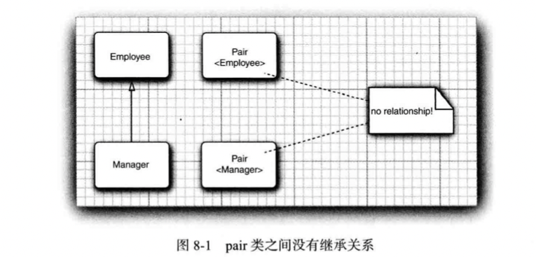

## Section 8 泛型程序设计

[TOC]

### 8.1 为什么要使用泛型程序设计

**泛型程序设计(Generic programming) 意味着编写的代码可以被很多不同类型的对象所重用**，例如：我们并不希望为聚集 String 和 File 对象分别设计不同的类，以及 ArrayList 类可以聚集任何类型的对象。

#### 8.1.1 类型参数的好处

在 Java 中增加范型类之前， 泛型程序设计是用**继承**实现的。ArrayList 类只维护一个 Object 引用的数组:

```java
public class ArrayList // before generic classes
{
  private Object[] elementData;
  ...
  public Object get(int i){...}
  public void add(Object o){...}
}
```

这种方法有两个问题:

+  当获取一个值时必须进行强制类型转换

```java
ArrayList files = new ArrayList();
...
String filename = (String) files.get(0);
```

+ 这里没有错误检査，可以向数组列表中添加任何类的对象。对于下面的调用， 编译和运行都不会出错，然而如果将 get 的结果强制类型 转换为 String 类型， 就会产生一个错误。

```java
files.add(new File(...)); 
```

**泛型提供了一个解决方案: 类型参数 (type parameters )。** ArrayList 类有一个类型参数用来指示元素的类型:

```java
ArrayList<String> files = new ArrayList<String>();
```

这使得代码具有更好的可读性，可以知道数组列表中包含的是 String 对象。

> 在 Java SE 7 及以后的版本中， 构造函数中可以省略泛型类型:  ArrayList<String> files = new ArrayList();

编译器也可以很好地利用这个信息。 当调用 get 的时候，不需要进行强制类型转换，编译器就知道返回值类型为 String， 而不是 Object:

```java
String filename = files.get(0);
```

编译器还知道 ArrayList <String> 中 add 方法有一个类型为 String 的参数，这将比使用 Object 类型的参数安全一些。**编译器可以进行检査，避免插人错误类型的对象。**例如:

```java
files.add(new File("...")); // can only add String objects to an ArrayList<String>
```

**类型参数的魅力在于: 使得程序具有更好的可读性和安全性。**


#### 8.1.2 谁想成为泛型程序员

使用像 ArrayList 的泛型类很容易。大多数 Java 程序员都使用 `ArrayList<String> `这样的类型。但是， 实现一个泛型类并没有那么容易。

> 对于类型参数，使用这段代码的程序员可能想要内置(plugin) 所有的类。他们希望在没有过多的限制以及混乱的错误消息的状态下， 做所有的事情。 因此，一个泛型程序员的任务就是预测出所用类的未来可能有的所有用途。

下面是标准类库的设计者们产生争议的一个典型问题：

AirayList 类有一个方法 addAll 用来添加另一个集合的全部元素。 程序员可能想要将 `ArrayList<Manager>` 中的所有元素添加到 `ArrayList<Employee>` 中去。如果只能允许前一个调用，而不能允许后一个调用呢？Java语言的设计者发明了一个具有独创性的新概念，通配符类型 (wildcard type)，解决了这个问题。通配符类型非常抽象， 然而， 它们能让库的构建者编写出尽可能灵活的方法。

泛型程序设计划分为 3 个能力级别：

+ 基本级别是， 仅仅使用泛型类——典型的是像ArrayList 这样的集合，不必考虑它们的工作方式与原因。
+ 第二个阶段：当把不同的泛型类混合在一起时，或是在与对类型参数代码进行衔接时，可能会看到含混不清的错误消息。 这个阶段需要学习 Java 泛型来系统地解决这些问题， 而不要胡乱地猜测。 
+ 最终级别是想要实现自己的泛型类与泛型方法。

应用程序员很可能不喜欢编写太多的泛型代码。JDK 开发人员已经做出了很大的努力，**为所有的集合类提供了类型参数**。 凭经验来说， 那些原本涉及许多来自通用类型(如 Object 或 Comparable 接口)的强制类型转换的代码一定会因使用类型参数而受益。


### 8.2 定义简单泛型类

**泛型类(generic class) 就是具有一个或多个类型变量的类。**本章使用一个简单的 Pair 类作为例子，我们只关注泛型，而不会为数据存储的细节烦恼。

```java
public class Pair<T>{
  private T first; 
  private T second;
  
	public Pair() { first = null ; second = null ; }
	public Pair(T first, T second) { this.first = first; this.second = second; }
  
	public T getFirst() { return first; } 
  public T getSecond() { return second; }
  
	public void setFirst(T newValue) { first = newValue; }
	public void setSecond(T newValue) { second = newValue; }
}
```

**Pair类引入了一个类型变量T**，用尖括号括起来，并放在类名的后面。泛型类可以有多个类型变量例如，可以定义 Pair 类，其中第一个域和第二个域使用不同的类型:

```java
public class Pair<T,U> { . . . }
```

类定义中的类型变量指定方法的返回类型以及域和局部变量的类型。 例如:

```java
private T first; // uses the type variable
```

用具体的类型替换类型变量就可以实例化泛型类型， 例如:

```java
Pair<String>
void setFirst(String)
...
```

> 从表面上看， Java 的泛型类类似于 C++ 的模板类。唯一明显的不同是 Java 没有专用的 template 关键字。 但是， 在本章中将会看到两种机制有着本质的区别。


### 8.3 泛型方法

前面已经介绍了如何定义一个泛型类，实际上， 还可以定义一个带有类型参数的简单方法。

```java
class ArrayAlg{
  public static <T> T getMiddle(T...a){
    return a[a.length / 2];
  }
}
```

泛型方法可以定义在普通类中， 也可以定义在泛型类中。然而这是一个泛型方法，可以从尖括号和类型变量看出这一点。**注意，类型变量放在修饰符(这里是 public static) 的后面，返回类型的前面。**

当调用一个泛型方法时，在方法名前的尖括号中放人具体的类型:

```java
String middle = ArrayAlg.<String>getMiddle("John", "Q.", "Public");
```

在大多数情况下， 方法调用中可以省略` <String> `类型参数。编译器有足够的信息能够推断出所调用的方法，它用 names 的类型与泛型类型 T[ ] 进行匹配并推断出 T 一定是 String。也就是说， 可以调用

```java
String middle = ArrayAlg.getMiddle("John", "Q.", "Public");
```

几乎在大多数情况下，对于泛型方法的类型引用没有问题。 偶尔编译器也会提示错误，此时需要解译错误报告:

```java
double middle = ArrayAlg.getMiddle(3.14, 1729, 0);
```

错误消息会以晦涩的方式指出：解释这句代码有两种方法，而且这两种方法都是合法的。

>  编译器将会自动打包参数为 1 个 Double 和 2 个 Integer 对象， 而后寻找这些类的共同超类型。事实上可以找到 2 个这样的超类型: Number 和 Comparable 接口。在这种情况下，可以采取的补救措施是将所有的参数写为 double 值。

如果想知道编译器对一个泛型方法调用最终推断出哪种类型， 可以有目的地引入一个错误，并研究所产生的错误消息。例如调用 `ArrayAlg.getMiddle(“ Hello”，0，null);` 将会得到一个错误报告:

```
found:
java.1ang.0bject&java.io.Seriallzable&java.lang.Comparable<? extends java.1ang.0bject&java.io.Seriallzable&java.lang.Comparable<?>>
```

大致的意思是: 可以将结果赋值给 Object、Serialiable 或 Comparable。


### 8.4 类型变量的限定

类或方法需要对类型变量加以约束，下面是一个典型的例子，我们要计算数组中的最小元素:

```java
class ArrayAlg{
  public static <T> T min(T[] a){ // almost correct
    if (a null || a.length = 0) return null;
    T smallest = a[0];
    for (int i = 1; i < a.length; i++)
      if (smallest.compareTo(a[i]) > 0) smallest = a[i];
    return smallest
  }
}
```

min方法的代码内部中，变量smallest类型为T，这意味着它可以是任何一个类的对象。 **怎么才能保证 T 所属的类有 compareTo 方法呢?** 

解决这个问题的方案是将 T 限制为实现了 Comparable 接口 ，可以通过对类型变量 T 设置限定(bound) 实现这一点:

```
public static <T extends Comparable> T min(T[] a) . . .
```

实际上 Comparable 接口本身就是一个泛型类型。目前， 我们忽略其复杂性以及编译器产生的警告。 第 8.8 节讨论了如何在 Comparable 接口中适当地使用类型参数。现在， 泛型的 min 方法只能被实现了 Comparable 接口的类(如 String、 LocalDate 等)的数组调用。 由于 Rectangle 类没有实现 Comparable 接口， 所以调用 min 将会产生一个编译错误。

> 在 Java 的继承中， 可以根据需要拥有多个**接口**超类型， 但限定中**至多有一个类**。 如果用 一个类作为限定， 它必须是限定列表中的第一个。


### 8.5 泛型代码和虚拟机

虚拟机没有泛型类型对象，所有对象都属于普通类。

#### 8.5.1 类型擦除

无论何时定义一个泛型类型， 都自动提供了一个相应的**原始类型(raw type)**。原始类型的名字就是删去类型参数后的泛型类型名。 **擦除 ( erased ) 类型变量 , 并替换为限定类型 (无限定的变量用 Object)。**

**例如， Pair<T> 的原始类型如下所示:**

```java
public class Pair
{
 	private Object first;
  private Object second;
  
 	public Pair(Object first, Object second){
    this.first = first; 
    this.second = second;
  }
  public Object getFirst() {return first;} 
  public Object getSecond() {return second;}
  
  public void setFirst(Object newValue) { first = newValue; }
	public void setSecond(Object newValue) { second = newValue; }
}
```

因为 T 是一个无限定的变量， 所以直接用 Object 替换 -> 结果是一个普通的类。在程序中可以包含不同类型的 Pair, 例如，`Pair<String>` 或 `Pair<LocalDate>`，而擦除类型后就变成原始的 Pair 类型了。

> C++ 注释: 就这点而言， Java 泛型与 C++ 模板有很大的区别。C++ 中每个模板的实例化产生不同的类型，这一现象称为“ 模板代码膨账”。Java不存在这个问题的困扰。

**原始类型用第一个限定的类型变量来替换， 如果没有给定限定就用 Object 替换。**例如， 类 Pair<T> 中的类型变量没有显式的限定， 因此， 原始类型用 Object 替换 T。

 假定声明了一个不同的类型:

```java
public class Interval <T extends Comparable & Serializable〉 implements Serializable{
  private T lower; 
  private T upper;
	...
  public Interval(T first, T second){
    if (first.compareTo(second) <= 0) { lower = first; upper = second;}
    else {lower = second; upper = first; } 
  }
}
```

原始类型 Interval 如下所示:

```java
public class Interval implements Serializable {
	private Comparable lower; 
  private Comparable upper;
	public Interval (Comparable first , Comparable second) { . . . } 
}
```

> class Interval<T extends Serializable & Comparable> 会发生什么。如果这样做，原始类型用Serializable替换T, 而编译器在必要时要向 Comparable 插入强制类型转换。 为了提高效率， 应该将标签(tagging) 接口 (即没有方法的接口)放在边界列表的末尾。


#### 8.5.2 翻译泛型表达式

**当程序调用泛型方法时，如果擦除返回类型，编译器插入强制类型转换。** 例如，下面这个语句序列:

```java
Pair<Employee> buddies = ...; 
Employee buddy = buddies.getFirst();
```

**擦除 getFirst 的返回类型后将返回 Object 类型。**编译器自动插入 Employee 的强制类型转换，也就是说编译器把这个方法调用翻译为两条虚拟机指令:

+ 对原始方法 Pair.getFirst 的调用。
+ 将返回的 Object 类型强制转换为 Employee 类型。


#### 8.5.3 翻译泛型方法

类型擦除也会出现在泛型方法中。 程序员通常认为下述的泛型方法：

```java
public static <T extends Comparable> T min(T[] a)
```

是一个完整的方法族， 而擦除类型之后， 只剩下一个方法:

```java
public static Comparable min(Comparable[] a)
```

类型参数 T 被擦除，只留下了限定类型 Comparable。方法的擦除带来了两个复杂问题，如下：

```java
class Datelnterval extends Pair<LocalDate>{
  public void setSecond(LocalDate second){
    if(second.compareTo(getFirst() >= 0))
      super.setSecond(second);
  }
}
```

**一个日期区间是一对 LocalDate 对象， 并且需要覆盖这个方法来确保第二个值永远不小于第一个值。 这个类擦除后变成:**

```java
class Datelnterval extends Pair{// after erasure
  public void setSecond(LocalDate second){...}
}
```

令人感到奇怪的是， 存在另一个从 Pair 继承的 setSecond 方法，即

```java
public void setSecond(Object second)
```

这显然是一个不同的方法， 因为它有一个不同类型的参数--Object，而不是 LocalDate。然而， 不应该不一样。 考虑下面的语句序列:

```java
Datelnterval interval = new Datelnterval(...);
Pair<Loca1Date> pair = interval; // OK assignment to superclass 
pair.setSecond(aDate) ;
```

这里， 希望对 setSecond 的调用具有多态性， 并调用最合适的那个方法。 由于 pair 引用 Datelnterval 对象， 所以应该调用 Datelnterval.setSecond。**问题在于类型擦除与多态发生了冲突。**要解决这个问题， 就需要**编译器在 Datelnterval 类中生成一个桥方法(bridge method):**

```java
public void setSecond(Object second) { 
  setSecond((Date) second);
} 
```

要想了解它的工作过程， 请仔细地跟踪下列语句的执行:

```
pair.setSecond(aDate)
```

变量 pair 已经声明为类型 `Pair<LocalDate> `, 并且这个类型只有一个简单的方法叫setSecond， 即setSecond(Object)。 虚拟机用 pair 引用的对象调用这个方法。 这个对象是 Datelnterval 类型的， 因而将会调用 Datelnterval.setSecond(Object) 方法，这个方法是合成的桥方法。

**桥方法可能会变得十分奇怪，假设 Datelnterval 方法也覆盖了 getSecond 方法:**

```java
class Datelnterval extends Pair<LocalDate>{
	public LocalDate getSecond() { return (Date) super.getSecond().clone(); }
	...
}
```

在 Datelnterval 类中， 有两个 getSecond 方法:

```java
LocalDate getSecond() // defined in Datelnterval
Object getSecond() // overrides the method defined in Pair to call the first method
```

不能这样编写 Java 代码，它们都没有参数。 **但是在虚拟机中， 用参数类型和返回类型确定一个方法。 因此，编译器可能产生两个仅返回类型不同的方法字节码， 虚拟机能够正确地处理这一情况。**

总之， 需要记住有关 Java 泛型转换的事实：

+ 虚拟机中没有泛型， 只有普通的类和方法。 
+ 所有的类型参数都用它们的限定类型替换。 
+ 桥方法被合成来保持多态。 
+ 为保持类型安全性， 必要时插人强制类型转换。


#### 8.5.4 调用遗留代码

设计 Java 泛型类型时，主要目标是允许泛型代码和遗留代码之间能够互操作。 下面看一个具体的示例。 要想设置一个 JSlider 标签， 可以使用方法:

```java
void setLabelTable(Dictionary table)
```

在这里，Dictionary 是一个原始类型， 因为实现 JSlider 类时 Java 中还不存在泛型。不过，填充字典时， 要使用泛型类型。

```java
Dictionary<Integer, Component> labelTable = new Hashtable<>();
labelTable.put(0, new JLabel(new Imagelcon("nine.gif")));
labelTable.put(20, new JLabel(new Imagelcon("ten.gif")));
```

将Dictionary<Integer, Component>对象传递给setLabelTable时，编译器会发出一个警告：

```java
slider.setLabelTable(labelTable); // warning
```

毕竟， 编译器无法确定 setLabelTable 可能会对 Dictionary 对象做什么操作。 这个方法可 能会用字符串替换所有的key。这就打破了key类型为整型(Integer) 的承诺，未来的操作有可能会产生强制类型转换的异常。可以忽略这个警告。

现在，看一个相反的情形，由一个遗留的类得到一个原始类型的对象。 可以将它赋给一个参数化的类型变量，这样做会看到一个警告。 例如:

```java
Dictionary<Integer, Components> labelTable = slider.getLabelTableO; // Warning
```

再看一看警告， 确保标签表已经包含了 Integer 和 Component 对象。最差的情况就是程序抛出一个异常。


### 8.6 约束与局限性

#### **8.6.1 不能用基本类型实例化类型参数**

**不能用类型参数代替基本类型。**因此，`没有Pair<double>`, 只有`Pair<Double>`。当然，其原因是类型擦除。 擦除之后， Pair 类含有 Object 类型的域， 而 Object 不能存储 double 值。


#### **8.6.2 运行时类型查询只适用于原始类型**

**虚拟机中的对象总有一个特定的非泛型类型。因此， 所有的类型查询只产生原始类型。** 例如:

```java
if (a instanceof Pair<String>) // Error
```

实际上仅仅测试 a 是否是任意类型的一个 Pair。 下面的测试同样如此:

```java
if (a instanceof Pair<T>) // Error
```

或强制类型转换:

```java
 Pair<String> p = (Pair<String>) a; // Warning--can only test that a is a Pair
```

为提醒这一风险， 试图查询一个对象是否属于某个泛型类型时， **倘若使用 instanceof 会得到一个编译器错误， 如果使用强制类型转换会得到一个警告。**

同样的道理， getClass 方法总是返回原始类型。 例如：

```java
Pair<String> stringPair = ...;
Pair<Employee> employeePair = ...;
if(stringPair.getClass() == employeePair.getClass()) // they are equal
```

其比较的结果是true, 这是因为两次调用getClass都将返回Pair.class。


#### **8.6.3 不能创建参数化类型的数组**

**不能实例化参数化类型的数组， 例如:**

```java
Pair<String>[] table = new Pair<String>[10]; // Error
```

这有什么问题呢? 擦除之后，table 的类型是 Pair[] 。可以把它转换为 Object[]:

```java
Object[] objarray = table;
```

数组会记住它的元素类型， 如果试图存储其他类型的元素， 就会抛出一个 Array- StoreException 异常:

```java
objarray[0] = "Hello"; // Error component type is Pair
```

 不过对于泛型类型， 擦除会使这种机制无效。 以下赋值:

```java
 objarray[0] = new Pair<Employee>();
```

 **能够通过数组存储检査， 不过仍会导致一个类型错误。 出于这个原因， 不允许创建参数化类型的数组。**

 **需要说明的是， 只是不允许创建这些数组，** 而声明类型为 `Pair<String>[]` 的变量仍是合法的。不过不能用 `new Pair<String>[10] `初始化这个变量。可以声明通配类型的数组， 然后进行类型转换:

```java
Pair<String>[] table = (Pair<String>[]) new Pair<?>[10]
```

结果将是不安全的。如果在table[0]中存储一个`Pair<Employee>`，然后对table[0].getFirst() 调用一个 String 方法， 会得到一个 ClassCastException 异常。


#### **8.6.4 Varargs 警告**

这一节中我们讨论一个问题：**向参数个数可变的方法传递一个泛型类型的实例。**

考虑下面这个简单的方法， 它的参数个数是可变的:

```java
public static <T> void addAll(Collections<T> coll, T... ts){
  for (t : ts) coll.add(t);
}
```

应该记得， 实际上参数 ts 是一个数组， 包含提供的所有实参。 现在考虑以下调用:

```java
Col1ection<Pair<String>> table = . . .;
Pair<String> pair1 = ...;
Pair<String> pair2 = ...;
addAll(table, pairl, pair2);
```

为了调用这个方法，Java 虚拟机必须建立一个 `Pair<String>` 数组， 这就违反了前面的规则。

可以采用两种方法来抑制这个警告。 

一种方法是为包含 addAll 调用的方法增加注解 @ SuppressWamings("unchecked") 或者在 Java SE 7 中， 还可 以用 @SafeVarargs 直接标注 addAll 方法:

```java
@SafeVarargs
public static <T> void addAll(Collection<T> coll, T... ts)
```

现在就可以提供泛型类型来调用这个方法了。 对于只需要读取参数数组元素的所有方法， 都可以使用这个注解， 这仅限于最常见的用例。


#### **8.6.5 不能实例化类型变置**

不能使用像 new T(...) newT[...] 或 T.class 这样的表达式中的类型变量。下面的 `Pair<T>` 构造器就是非法的:

```java
public Pair() { first = new T(); second = new T(); } // Error
```

**类型擦除将 T 改变成 Object**，而且，本意肯定不希望调用 new Object()；在 Java SE 8 之后， 最好的解决办法是让调用者提供一个构造器表达式。 例如:

```java
Pair<String> p = Pair.makePair(String::new);
```

makePair 方法接收一个 `Supplier<T>`， 这是一个**函数式接口**， 表示一个无参数而且返回类型为 T 的函数:

```java
public static <T> Pair<T> makePair(Supplier<T> constr){
  return new Pair<>(constr.get(),constr.get());
}
```

表达式 T.class 是不合法的， 因为它会擦除为 Objectclass； 必须像下面这样设计 API 以便得 到一个 Class 对象:

```java
public static <T> Pair<T> makePair(Class<T> cl){
  try{
    return new Pair<>(cl.newInstance(),cl.newInstance());
  }catch(Exception ex){return null;}
}
```

这个方法可以按照下列方式调用:

```java
Pair<String> p = Pair.makePair(String.class);
```

注意，Class类本身是泛型。例如，String.daSS是一个Class<String> 的实例(事实上， 它是唯一的实例 。) 因此， makePair 方法能够推断出 pair 的类型。


#### 8.6.6 不能构造泛型数组

就像不能实例化一个泛型实例一样， 也不能实例化数组。 不过原因有所不同， 毕竟数组会填充 null 值， 构造时看上去是安全的。**不过， 数组本身也有类型， 用来监控存储在虚拟机中的数组。**这个类型会被擦除。 例如， 考虑下面的例子:

```java
public static<T extends Comparable> T[] minmax(T[] a) {
  T[] mm = new T[2];...
}//Error
```

**类型擦除会让这个方法永远构造 Comparable[2] 数组。**

如果数组仅仅作为一个类的私有实例域， 就可以将这个数组声明为 Object[]， 并且在获取元素时进行类型转换。例如`ArrayList` 类可以这样实现:

```java
public class ArrayList<E>{
  private Object[] elements;
  ...
  @SuppressWarnings("unchecked") 
  public E get(int n) { return (E) elements[n]; }
  public void set(int n, E e) { elements[n] = e; } // no cast needed
}
```

实际的实现没有这么清晰:

```java
public class ArrayList<E>{
  private E[] elements;
  ...
  public ArrayList() { elements = (E[]) new Object[10]; }
}
```

**这里， 强制类型转换 E[ ] 是一个假象， 而类型擦除使其无法察觉。**由于 minmax 方法返回 T[ ] 数组， 使得这一技术无法施展， 如果掩盖这个类型会有运行时错误结果。 假设实现代码:

```java
public static <T extends Comparable〉 T[] minmax(T... a){
  Object[] mm = new Object[2];
  ...
  return (T[]) mm; // compiles with warning
}
```

调用

```java
String[] ss = ArrayAlg.minmax("Tom", "Dick", "Harry");
```

编译时不会有任何警告。 告 Object[]引用赋给 Comparable[] 变量时， 将会发生 ClassCastException 异常。

**在这种情况下， 最好让用户提供一个数组构造器表达式:**

```java
String[] ss = ArrayAlg.minmax(String[]::new，"Tom", "Dick", "Harry");
```

构造器表达式 String::new 指示一个函数， 给定所需的长度， 会构造一个指定长度的 String 数组。

minmax 方法使用这个参数生成一个有正确类型的数组:

```java
public static <T extends Comparable〉 T[] minmax(IntFunction<T[]> constr, T... a){
  T[] mm = constr.apply(2);
  ...
}
```

**比较老式的方法是利用反射， 调用 Array.newlnstance:**

```java
public static <T extends Comparable〉 T[] minmax(T... a){
  T[] mm = (T[]) Array.newlnstance(a.getClass().getComponentType() , 2);
}
```


#### 8.6.7 泛型类的静态上下文中类型变量无效

不能在静态域或方法中引用类型变量。例如， 下列高招将无法施展:

```java
public class Singleton<T>{
  private static T singlelnstance; // Error
  public static T getSinglelnstance(){ // Error
    if (singleinstance == null) construct new instance of T
    return singleInstance;
  } 
}
```

如果这个程序能够运行， 就可以声明一个 `Singleton<Random>` 共享随机数生成器， 声明 一个 `Singleton<JFileChooSer>` 共享文件选择器对话框。但是， 这个程序无法工作。**类型擦除之后， 只剩下 Singleton 类， 它只包含一个 singlelnstance 域。** 因此， 禁止使用带有类型变量的静态域和方法。


#### 8.6.8 不能抛出或捕获泛型类的实例

既不能抛出也不能捕获泛型类对象。 实际上， 甚至泛型类扩展 Throwable 都是不合法的。 例如， 以下定义就不能正常编译:

```java
public class Problem<T> extends Exception { /* . . . */ } // Error can't extend Throwable
```

catch 子句中不能使用类型变量。 例如， 以下方法将不能编译:

```java
public static <T extends Throwable〉 void doWork(Class<T> t){
  try{
    do work
  }catch(T e) // Error can't catch type variable
  {
    Logger.global.info(...);
  }
}
```

不过， 在异常规范中使用类型变量是允许的。 以下方法是合法的:

```java
public static <T extends Throwable〉 void doWork(T t) throws T // OK
```


#### 8.6.9 可以消除对受查异常的检查

Java 异常处理的一个基本原则是， 必须为所有受查异常提供一个处理器。 不过可以利用泛型消除这个限制。 关键在于以下方法:

```java
c
```

假设这个方法包含在类 Block 中， 如果调用

```java
Block.<RuntimeException>throwAs(t) ;
```

编译器就会认为 t 是一个**非受查异常**。 以下代码会把所有异常都转换为编译器所认为的非受查异常:

```java
try {
	do work 
}
catch (Throwable t)
{
	B1ock.<RuntimeException>throwAs(t) ;
}
```

下面把这个代码包装在一个抽象类中，用户可以覆盖 body 方法来提供一个具体的动作。 **调用 toThread 时， 会得到 Thread 类的一个对象， 它的 run 方法不会介意受查异常。**

```java
public abstract class Block{
  public abstract void body() throws Exception;
  
	public Thread toTread(){
    return new Thread(){
      public void run(){
        try {
          do work 
        }
        catch (Throwable t)
        {
          B1ock.<RuntimeException>throwAs(t) ;
        }
      }
    }
  }
  
  @SuppressWamings("unchecked")
  public static <T extends Throwable〉void throwAs(Throwable e) throws T {
    throw (T) e; 
  }
}
```

例如， 以下程序运行了一个线程， 它会拋出一个受查异常。

```java
public class Test {
	public static void main(String[] args) {
		new Block() {
			public void body() throws Exception
			{
				Scanner in = new Scanner(new File("ququx"), "UTF-8"); 
        while (in.hasNext())
					System.out.println(in.next()); }
			}.toThread().start();
	} 
}
```

运行这个程序时，会得到一个栈轨迹，其中包含一个 FileNotFoundException ( 当然， 假设你没有提供一个名为 ququx 的文件 )。这有什么意义呢? **正常情况下， 你必须捕获线程 run 方法中的所有受查异常， 把它们 “ 包装” 到非受查异常中， 因为 run 方法声明为不抛出任何受查异常。**

不过在这里并没有做这种“ 包装”。我们只是抛出异常，并“ 哄骗” 编译器，让它认为这不是一个受查异常。**通过使用泛型类、 擦除和 @SuppressWamings 注解， 就能消除 Java 类型系统的部分基本限制。**


#### 8.6.10 注意擦除后的冲突

当泛型类型被擦除时，**无法创建引发冲突的条件**。下面是一个示例。假定像下面这样将 equals 方法添加到 Pair 类中:

```java
public class Pair<T>{
  public boolean equals(T value) { return first.equals(value) && second.equals(value); }
  ...
}
```

考虑一个 Pair< String>，从概念上讲， 它有两个 equals 方法 :

+ `boolean equals(String) // defined in Pair<T>`
+ `boolean equals(Object) // inherited from Object`

方法擦除 boolean equals(T) 就是 boolean equals(Object)，与 Object.equals 方法发生冲突。

当然， 补救的办法是**重新命名**引发错误的方法。 

泛型规范说明还提到另外一个原则:“ **要想支持擦除的转换， 就需要强行限制一个类或类型变量不能同时成为两个接口类型的子类， 而这两个接口是同一接口的不同参数化。**” 例如， 下述代码是非法的:

```java
class Employee implements Coinparab1e<Emp1oyee> { . . . }
class Manager extends Employee implements Comparable<Hanager> 
{ . . . } // Error
```

Manager 会实现 Comparable< Employee> 和 Comparable< Manager> , 这是同一接口 的不同参数化。

这一限制与类型擦除的关系并不十分明确。毕竟，下列非泛型版本是合法的:

```java
class Employee implements Comparable { . . . }
class Manager extends Employee implements Comparable { . . . }
```

其原因非常微妙， 有可能与合成的桥方法产生冲突。实现了 `Comparable<X>` 的类可以获得一 个桥方法:

```java
public int compareTo(Object other) { return compareTo((X) other); }
```

对于不同类型的 X 不能有两个这样的方法。


### 8.7 泛型类型的继承规则

考虑一个类和一个子类， 如 Employee 和 Manager。`Pair< Manager>` 是 `Pair<Employee>` 的一个子类吗? 答案是“ 不是”， 或许人们会感到奇怪。 例如，下面的代码将不能编译成功:

```java
Manager[] topHonchos = ...;
Pair<Employee> result = ArrayAlg.ininmax(topHonchos); // Error
```

minmax 方法返回 `Pair<Manager>`， 而不是 `Pair<Employee>`， 并且这样的赋值是不合法的。

无论 S 与 T 有什么联系 (如图 8-1 所示，) 通常， `Pair<S>` 与 `Pair<T>` 并没有什么联系。



这一限制看起来过于严格， 但对于类型安全非常必要。 假设允许将 `Pair< Manager>` 转换为 `Pair<Employee>`。考虑下面代码:

```java
Pair<Manager> managerBuddies = new Pair<>(ceo, cfo);
Pair<Employee> employeeBuddies = managerBuddies; // illegal, but suppose it wasn't 
employeeBuddies.setFirst(lowlyEmployee) ;
```

显然， 最后一句是合法的。 但是 employeeBuddies 和 managerBuddies 引用了同样的对象。现在将CFO和一个普通员工组成一对，这是不可能的。

**必须注意泛型与 Java 数组之间的重要区别。 可以将一个 Manager[] 数组賦给一个类型为 Employee[] 的变量:**

```java
Manager[] managerBuddies = {ceo, cfo};
Employee[] employeeBuddies = managerBuddies; // OK
```

然而数组带有特别的保护，如果试图将一个低级别的雇员存储到 employeeBuddies[0] ，虚拟机将会抛出 ArrayStoreException 异常。

永远可以将参数化类型转换为一个原始类型。 例如，` Pair<Employee> `是原始类型 Pair 的一个子类型。 在与遗留代码衔接时， 这个转换非常必要。**转换成原始类型之后会产生类型错误吗? 会! 看一看下面这个示例:**

```java
Pair<Manager> managerBuddies = new Pairo(ceo, cfo);
Pair rawBuddies = managerBuddies; // OK
rawBuddies.setFirst(new File(". . .")); // only a compile-time warning
```

最后， 泛型类可以扩展或实现其他的泛型类。 就这一点而言， 与普通的类没有什么 区别。例如，`ArrayList<T>` 类实现 `List<T>` 接口。这意味着， 一个 `ArrayList<Manager>` 可以被转换为一个 `List< Manager>`。 但是， 如前面所见， 一个 `ArrayList< Manager>` 不是一个` ArrayList <Employee>` 或 `List<Employee>`。图 8-2 展示了它们之间的联系。

