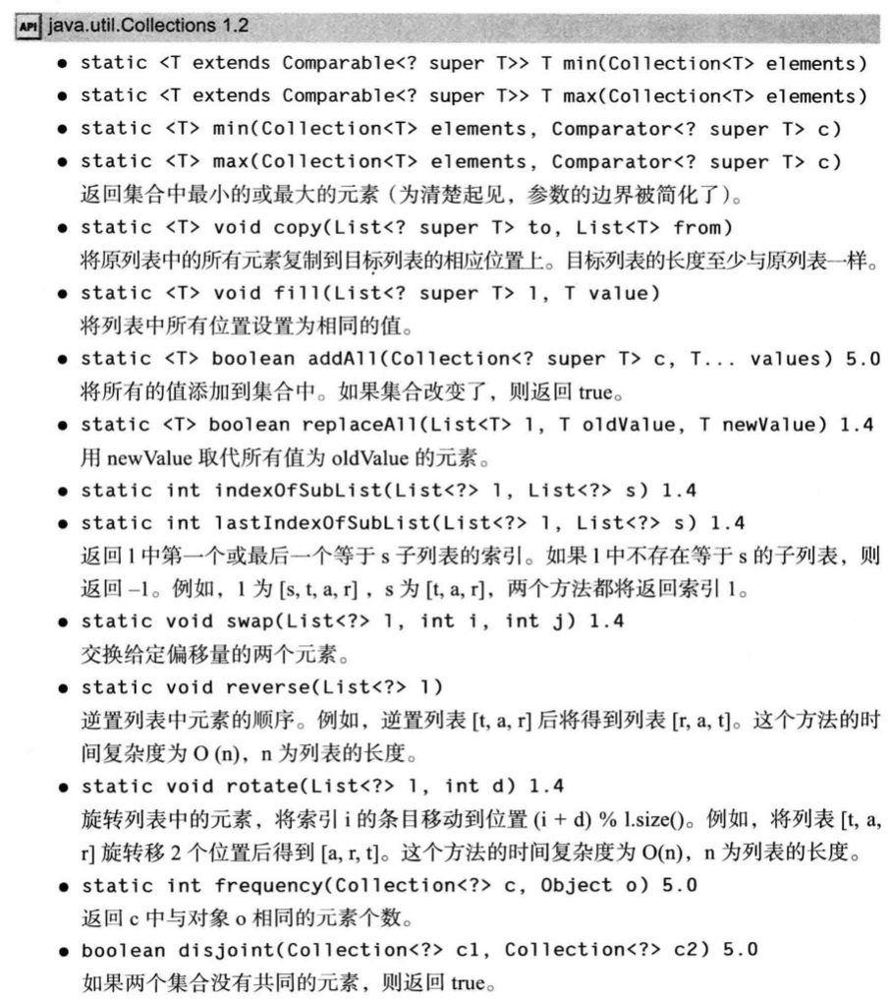

## Section 9 集合

[TOC]

### 9.1 Java集合框架

#### 9.1.1 将集合的接口与实现分离

Java集合类库中将接口(interface) 与实现 (implementation) 分离。

首先看一下队列(queue) 是如何分离的：队列接口指出可在队列的尾部添加元素， 在队列的头部删除元素， 并且可以査找队列中元素的个数。当需要收集对象， 并按照“ 先进先出” 的规则检索对象时就应该使用队列。

队列接口的最简形式可能类似下面这样:

```java
public interface Queue<E> // a simplified form of the interface in the standard library
{
  void add(E element);
  E remove();
	int size();
}
```

队列通常有两种实现方式:

+ 循环数组
+ 链表


每一个实现都可以通过一个实现了 Queue 接口的类表示:

```java
public class CicularArayQueue<E> implements Queue<E>{ // not an actual library class
 	private int head;
  private int tail;
  
  CircularArrayQueue(int capacity) {...} 
  public void add(E element) {...} 
	public E remove() {...} 
	public int size() {...}  
  private E[] elements;
} 

public class LinkedListQueue<E> implements Queue<E>{ // not an actual library class
  private int head;
  private int tail;
  
  LinkedListQueue(){...}
  public void add(E element) {...} 
	public E remove() {...} 
	public int size() {...}  
}
```

**实际上， Java 类库没有名为 CircularArrayQueue 和 LinkedListQueue 的类。** 这里， 只是以这些类作为示例， 解释一下集合接口与实现在概念上的不同。 如果需要一个循环数组队列， 就可以使用 ArrayDeque 类。如果需要一个链表队列， 就直接使用 LinkedList 类， 这个类实现了 Queue 接口。

当在程序中使用队列时， 一旦构建了集合就不需要知道究竟使用了哪种实现（**封装性的体现**），只有在构建集合对象时，使用具体的类才有意义。**可以使用接口类型存放集合的引用**：

```java
Queue<Customer> expressLane = new CircularArrayQueue<>(100); 
expressLane.add(new Customer("Harry"));
```

可以轻松地使用另外一种不同的实现。  如果觉得 LinkedListQueue 是个更好的选择， 就将代码修改为:

```java
Queue<Customer> expressLane = new LinkedListQueue<>(100); 
expressLane.add(new Customer("Harry"));
```

**接口本身并不能说明哪种实现的效率究竟如何：**

>  循环数组要比链表更高效，因此多数人优先选择循环数组，通常这样做也需要付出一定的代价。循环数组是一个有界集合， 即容量有限。如果程序中要收集的对象数量没有上限， 就最好使用链表来实现。

在研究 API 文档时， 会发现另外一组名字以 Abstract 开头的类，例如，AbstractQueue。 这些类是为类库实现者而设计的。 如果想要实现自己的队列类会发现扩展 AbstractQueue 类要比实现 Queue 接口中的所有方法轻松得多。


#### 9.1.2 Collection 接口

在 Java 类库中， **集合类的基本接口是 Collection 接口**。这个接口有两个基本方法:

```java
public interface Collection<E>{
	boolean add(E element);
  Iterator<E> iterator();
  ...
}
```

除了这两个方法之外， 还有几个方法， 将在稍后介绍。

+ add 方法用于向集合中添加元素。如果添加元素确实改变了集合就返回 true, 否则返回 false。 例如，如果这个对象在集中已经存在，这个添加请求就没有实效，因为集合中不允许有重复的对象。

+ iterator 方法用于返回一个实现了 Iterator 接口的对象，可以使用这个迭代器对象依次访问集合中的元素。 


#### 9.1.3 迭代器

Iterator 接口包含 4 个方法:

```java
public interface Iterator<E>{
  E next();
	boolean hasNext();
	void remove();
	default void forEachRemaining(Consumer<? super E> action);
}
```

通过反复调用 next 方法，可以逐个访问集合中的每个元素。但是，如果到达了集合的末尾，next 方法将抛出一个 NoSuchElementException。因此，需要在调用 next 之前调用 hasNext 方法。

如果想要査看集合中的所有元素，就请求一个迭代器，并在 hasNext 返回 true 时反复地调用 next 方法。 例如:

```java
Collection<String> c = ...;
Iterator<String> iter = c.iterator();
while(iter.hasNext()){
  String element = iter.next();
  do something with element
}
```

用“ foreach ” 循环可以更加简练地表示同样的循环操作:

```java
for (String element : c){
  do something with element
}
```

**编译器简单地将“ foreach ” 循环翻译为带有迭代器的循环。**“ for each ” 循环可以与任何实现了 **Iterable 接口**的对象一起工作， 这个接口只包含一个抽象方法:

```java
public interface Iterable<E>{
	Iterator<E> iterator();
  ...
}
```

**Collection 接口扩展了 Iterable 接口。因此， 对于标准类库中的任何集合都可以使用“ for each” 循环。**在JavaSE8中，甚至不用写循环。可以调用forEachRemaining方法并提供lambda 表达式(它会处理一个元素)。 将对迭代器的每一个元素调用这个 lambda 表达式， 直到再没有元素为止。

```java
iterator.forEachRemaining(element -> do something with element);
```

注意：某些集合类型的遍历并不一定能保证顺序。

Java 迭代器查找一个元素的唯一方法是调用next，而在执行查找操作的同时，迭代器的位置随之向前移动。**因此，应该将 Java 迭代器认为是位于两个元素之间。**当调用 next 时，**迭代器就越过下 一个元素，并返回刚刚越过的那个元素的引用** (见图 9-3 ) 。


> 这里还有一个有用的推论。 可以将 Iterator.next 与 InputStream.read 看作为等效的。从数据流中读取一个字节， 就会自动地“ 消耗掉” 这个字节，下一次调用 read 将会消耗并返回输入的下一个字节；用同样的方式，反复地调用 next 就可以读取集合中所有元素。

**Iterator 接口的 remove 方法将会删除上次调用 next 方法时返回的元素。**在大多数情况下，在决定删除某个元素之前应该先看一下这个元素是很具有实际意义的。**然而， 如果想要删除指定位置上的元素，仍然需要越过这个元素。** 例如，下面是如何删除字符串集合中第一个元素的方法:

```java
Iterator<String> it = c.iterator();
it.next(); // skip over the first element
it.remove(); // now remove it
```

更重要的是，对 next 方法和 remove 方法的调用具有互相依赖性。 如果调用 remove 之前没有调用 next 将是不合法的，如果这样做， 将会抛出一个 IllegalStateException 异常。

如果想删除两个相邻的元素， 不能直接地这样调用:

```java
it.remove(); 
it.remove();// Error!
```

相反地， 必须先调用 next 越过将要删除的元素。

```java
it.remove();
it.next();
it.remove(); // OK
```


#### 9.1.4 泛型实用方法

**由于 Collection 与 Iterator 都是泛型接口，可以编写操作任何集合类型的实用方法。** 例如，下面是一个检测任意集合是否包含指定元素的泛型方法:

```java
public static <E> boolean contains(Collection<E> c, Object obj){
	for (E element : c)
		if (element.equals(obj)) 
      return true;
  return false; 
}
```

Java 类库的设计者认为：这些实用方法中的某些方法非常有用， 应该将它们提供给用户使用。这样类库的使用者就不必自己重新构建这些方法了，contains 就是这样一个实用方法。

事实上，**Collection 接口声明了很多有用的方法，所有的实现类都必须提供这些方法。**下面列举了其中的一部分:

```java
int size()
boolean isEmpty()
boolean contains(Object obj)
boolean containsAl1(Col1ection<?> c)
boolean equals(Object other)
boolean addAll (Collection<? extends E> from) 
boolean remove(Object obj)
boolean removeAl1(Col1ection<?> c)
void clear()
boolean retainAl1(Col1ection<?> c)
Object口 toArray()
<T> T[] toArray(T[] arrayToFill)
```

**当然，如果实现 Collection 接口的每一个类都要提供如此多的例行方法将是一件很烦人的事情。**为了能够让实现者更容易地实现这个接口， **Java 类库提供了一个类 AbstractCollection，**它将基础方法 size 和 iterator 抽象化了，但是在此提供了例行方法。例如:

```java
public abstract class AbstractCollection<E> implements Collection<E>{
  ...
  public abstract Iterator<E> iterator();
  public boolean contains(Object obj){
    for(E element : this) // calls iterator()
      if(element,equals(obj))
        return = true;
    return false;
  }
  ...
}
```

此时， 一个具体的集合类可以扩展 AbstractCollection 类了。**现在要由具体的集合类提供 iterator 方法，而 contains 方法已由 AbstractCollection 超类提供了**。 如果子类有更加有效的方式实现 contains 方法， 也可以由子类提供。

对于 Java SE 8 , 已经增加了很多默认方法。其中大部分方法都与流的处理有关。还有一个很有用的方法:

```java
default boolean removelf(Predicate<? super E> filter)
```

这个方法用于删除满足某个条件的元素。


#### 9.1.5 集合框架中的接口

Java 集合框架为不同类型的集合定义了大量接口， 如图 9-4 所示:


集合有两个基本接口: Collection 和 Map。 我们已经看到， 可以用以下方法在集合中插入元素:

```java
boolean add(E element)
```

不过， 由于映射包含键值对， 所以要用 put 方法来插人:

```java
V put(K key, V value)
```

要从集合读取元素， 可以用迭代器访问元素。不过， 从映射中读取值则要使用 get 方法:

```java
V get(K key)
```

**List是一个有序集合：元素会增加到容器的特定位置。**可以采用两种方式访问元素: 

+ 使用迭代器访问
+ 使用一个整数索引来访问。

后一种方法称为随机访问(random access)，因为这样可以按任意顺序访问元素。与之不同，使用迭代器访问时，必须顺序地访问元素。

List 接口定义了多个用于随机访问的方法:

```java
void add(int index, E element) 
void remove(int index)
E get(int index)
E set(int index, E element)
```

Listlterator 接口是 Iterator 的一个子接口。它定义了一个方法用于在迭代器位置前面增加一个元素:

```java
void add(E element)
```

**坦率地讲， 集合框架的这个方面设计得很不好**：实际中有两种有序集合， 其性能开销有很大差异。 

+ 由数组支持的有序集合可以快速地随机访问， 因此适合使用 List 方法并提供一个 整数索引来访问。
+ 链表尽管也是有序的， 但是随机访问很慢， 所以最好使用迭代器来遍历。 如果原先提供两个接口就会容易一些了。

为了避免对链表完成随机访问操作， Java SE 1.4 引入了一个标记接口 RandomAccess。这个接口不包含任何方法，不过可以用它来测试一个特定的集合是否支持高效的随机访问:

```java
if (c instanceof RandomAccess) {
	use random access algorithm
	else {
		use sequential access algorithm
  }
}
```

**Set接口等同于Collection接口，不过其方法的行为有更严谨的定义:**

+ set的add方 法不允许增加重复的元素。 
+ equals 方法: 只要两个集包含同样的元素就认为是相等的， 而不要求这些元素有同样的顺序。
+  hashCode 方法的定义要保证包含相同元素的两个集得到相同的散列码。

SortedSet 和 SortedMap 接口会提供用于排序的比较器对象，这两个接口定义了可以得到集合子集视图的方法，有关内容将在 9.4 节讨论。

最后， Java SE 6 引入了接口 NavigableSet 和 NavigableMap，其中包含一些用于**搜索和遍历有序集和映射的方法**(理想情况下， 这些方法本应当直接包含在 SortedSet 和 SortedMap 接口中)。TreeSet 和 TreeMap 类实现了这些接口。


### 9.2 具体的集合

表 9-1 展示了 Java 类库中的集合， 并简要描述了每个集合类的用途：**除了以 Map 结尾的类之外，其他类都实现了 Collection 接口， 而以 Map 结尾的类实现了 Map 接口。**


#### 9.2.1 链表

> 很多示例已经使用了数组以及动态的 ArrayList 类，然而他们都有一个重大的缺陷，就是**从数组的中间位置删除一个元素要付出很大的代价**， 其原因是数组中处于被删除元素之后的所有元素都要向数组的前端移动；在数组中间的位置上插入一个元素也是如此。

**链表(linked list) 解决了这个问题，链表将每个对象存放在独立的结点中，每个结点还存放着序列中下一个结点的引用；**在 Java 程序设计语言中， 所有链表实际上都是双向链接的(doubly linked)：每个结点还存放着指向前驱结点的引用。

+ 从链表中间删除一个元素是一个很轻松的操作， 即需要更新被删除元素附近的链接。
+ Java提供的类LinkedList简化了原始链表中绕来绕去的指针过程

在下面的代码示例中， 先添加 3 个元素， 然后再将第 2 个元素删除：

```java
List<String> staff = new LinkedList<>(); // LinkedList implements List 
staff.add("Amy") ;
staff.add("Bob");
staff.add("Carl");
Iterator iter = staff.iterator();
String first = iter.next(); // visit first element
String second = iter.next(); // visit second element
iter.remove(); // remove last visited element
```


链表是一个有序集合(ordered collection), 每个对象的位置十分重要。LinkedList.add方法将对象添加到链表的尾部。但是， 常常需要将元素添加到链表的中间，**集合类库提供了子接口ListIterator, 其中包含add方法:**

```java
interface ListIterator<E> extends Iterator<E>{
  void add(E element);
  ...
}
```

与 Collection.add 不同，这个方法不返回 boolean 类型的值，它假定添加操作总会改变链表。

**另外，ListIterator 接口有两个方法， 可以用来反向遍历链表：**与 next 方法一样， previous 方法返回越过的对象。

```java
E previous()
boolean hasPrevious()
```

LinkedList 类的 ListIterator 方法返回一个实现了 ListIterator 接口的迭代器对象。

```java
ListIterator<String> iter = staff.listIterator();
```

**Add 方法在迭代器位置之前添加一个新对象。**例如，下面的代码将越过链表中的第一个元素，并在第二个元素之前添加“ Juliet”:

```java
List<String> staff = new LinkedList(); 
staff.add("Amy");
staff.add("Bob");
staff.add("Carl");
ListIterator<String> iter = staff.listIterator(); 
iter.next();// skip past first element 
iter.add("Juliet") ;
```

**注意：**

> 在用“ 光标” 类比时要格外小心。remove 操作与 BACKSPACE 键的工作方式不 太一样。 在调用 next 之后， remove 方法确实与 BACKSPACE 键一样删除了迭代器左侧的元素。但是，如果调用 previous 就会将右侧的元素删除掉，并且不能连续调用两次 remove。add 方法只依赖于迭代器的位置，而 remove 方法依赖于迭代器的状态。

最后需要说明， set 方法用一个新元素取代调用 next 或 previous 方法返回的上一个元素。 例如， 下面的代码将用一个新值取代链表的第一个元素:

```java
ListIterator<String> iter = list.listIterator();
String oldValue = iter.next(); // returns first element 
iter.set(newValue); // sets first element to newValue
```

**如果在某个迭代器修改集合时，另一个迭代器对其进行遍历，一定会出现混乱的状况**。 例如，一个迭代器指向另一个迭代器刚刚删除的元素前面， 现在这个迭代器就是**无效**的， 并且不应该再使用。链表迭代器的设计使它能够检测到这种修改：如果迭器发现它的集合被另一个迭代器修改了，或是被该集合自身的方法修改了，就会抛出一个 **ConcurrentModificationException 异常**。 例如，看一看下面这段代码:

```java
List<String> list = ...;
ListIterator<String> iterl = list.listlterator(); 
ListIterator<String> iter2 = list.listlterator(); 
iterl.next();
iterl.remove();
iter2.next(); // throws ConcurrentModificationException
```

**由于 iter2 检测出这个链表被从外部修改了， 所以对 iter2.next 的调用抛出了一个异常。**

**关于迭代器修改的注意事项：**

+ 为了避免发生并发修改的异常， 请遵循下述简单规则：可以根据需要给容器附加许多的迭代器，但是这些迭代器只能读取列表。另外，再单独附加一个既能读又能写的迭代器。

+ 有一种简单的方法可以检测到并发修改的问题：集合可以跟踪改写操作(诸如添加或删除元素)的次数，每个迭代器都维护一个独立的计数值，在每个迭代器方法的开始处检查自己改写操作的计数值是否与集合的改写操作计数值一致；如果不一致， 抛出一个 ConcurrentModificationException 异常。

+ 对于并发修改列表的检测有一个奇怪的例外。链表只负责跟踪对列表的结构性修改，例如，添加元素、删除元素。 **set 方法不被视为结构性修改**。 可以将多个迭代器附加给一个链表， 所有的迭代器都调用 set 方法对现有结点的内容进行修改。 在本章后面所介绍的 Collections 类的许多算法都需要使用这个功能。


在上一节已经看到， Collection 接口中声明了许多用于对链表操作的有用方法，其中大部分方法都是在 LinkedList 类的超类 AbstractCollection 中实现的，例如：

+ toString 方法调用了所有元素的toString，并产生了一个很长的格式为[A,B，C]的字符串
+ contains 方法检测某个元素是否出现在链表中。

**在 Java 类库中， 还提供了许多在理论上存在一定争议的方法**：链表不支持快速地随机访问。如果要查看链表中第n个元素，就必须从头开始，越过n-1个元素，没有捷径可走。鉴于这个原因，在程序需要采用整数索引访问元素时，程序员通常不选用链表。**尽管如此，LinkedList 类还是提供了一个用来访问某个特定元素的 get 方法:**

```java
LinkedList<String> list = ...;
String obj = list.get(n);
```

这个方法的效率并不太高，如果发现自己正在使用这个方法， 说明有可能对于所要解决的问题使用了错误的数据结构。绝对不应该使用这种让人误解的随机访问方法来遍历链表。下面这段代码的**效率极低**：

```java
for(int i = 0; i < list.size(); i++)
	do something with list.get(i);
```

每次査找一个元素都要从列表的头部重新开始搜索，LinkedList 对象根本不做任何缓存位置信息的操作。get 方法做了微小的优化：如果索引大于 size() / 2 就从列表尾端开始搜索元素。


**列表迭代器接口还有一个方法， 可以返回当前位置的索引。** 从概念上讲， 由于 Java 迭代器指向两个元素之间的位置， 所以可以同时产生两个索引: 

+ nextlndex 方法返回下一 次调用 next 方法时返回元素的整数索引;
+ previouslndex 方法返回下一次调用 previous 方法时返回元素的整数索引；比 nextlndex 返回的索引值小 1

**这两个方法的效率非常高，这是因为迭代器保持着当前位置的计数值。**需要说一下，如果有一个整数索引n，`list.listlterator(n)` 将返回一个迭代器， 这个迭代器指向索引为 n 的元素前面的位置。也就是说， 调用 next 与调用list.get(n) 会产生同一个元素， 只是**获得这个迭代器的效率比较低**。

如果链表中只有很少几个元素，就完全没有必要为 get 方法和 set 方法的开销而烦恼。但是，**为什么要优先使用链表呢？** 

**使用链表的唯一理由是尽可能地减少在列表中间插人或删除元素所付出的代价**，如果列表只有少数几个元素， 就完全可以使用 ArrayList。我们建议**避免**使用以整数索引表示链表中位置的所有方法。 如果需要对集合进行随机访 问，就使用数组或 ArrayList，而不要使用链表。（ArrayList 的底层是数组队列，相当于动态数组。）

程序清单 9-1 中的程序使用的就是链表：它简单地创建了两个链表， 将它们合并在一起， 然后从第二个链表中每间隔一个元素删除一个元素， 最后测试 removeAIl 方法。 建议跟踪一 下程序流程， 并要特别注意迭代器。从这里会发现绘制一个下面这样的迭代器位置示意图是非常有用的:

```
|ACE 丨BDFC 
A|CE 丨BDFC 
AB|CE B|DFC
```


#### 9.2.2 数组列表

9.2.1中重点关注了LinkedList类，其内部构成原理主要是链表的数据结构。集合类库提供了一种大家熟悉的 ArrayList 类， 这个类也实现了 List 接口。 **ArrayList 封装了一个动态再分配的对象数组**。

对于一个经验丰富的 Java 程序员来说， 在需要动态数组时，可能会使用 Vector 类。**为什么要用 ArrayList 取代 Vector 呢:**

+ Vector 类的所有方法都是同步的，可以由两个线程安全地访问一个 Vector 对象。 但是，如果由一个线程访问 Vector，代码要在同步操作上耗费大量的时间。 
+  ArrayList 方法不是同步的。
+  建议在不需要同步时使用 ArrayList, 而不要使用 Vector。


#### 9.2.3 散列集

如果不在意元素的顺序，Java提供了几种能够快速査找元素的数据结构。 其缺点是无法控制元素出现的次序，它们将按照有利于其操作目的的原则组织数据，**散列表(hash table)就是其中一种**。

+ 散列表为每个对象计算一个整数，称为散列码(hashcode) 。
+ 散列码是由对象的实例域产生的一个整数，具有不同数据域的对象将产生不同的散列码。
+ 如果自定义类， 就要负责实现这个类的 hashCode 方法。 **注意，自己实现的 hashCode 方法应该与 equals 方法兼容，即如果a_equals(b)为true，a与b必须具有相同的散列码。**

**在 Java 中散列表用链表数组实现，每个列表被称为桶：**

+ 査找表中对象位置， 先计算它的散列码， 然后与桶的总数取余， 得到桶的索引。
+ 有时候会遇到桶被占满的情况， 这也是不可避免的。这种现象被称为**散列冲突(hash collision)**；这时， 需要用新对象与桶中的所有对象进行比较， 査看这个对象是否已经存在。
+ **在 JavaSE 8 中， 桶满时会从链表变为平衡二叉树。**如果选择的散列函数不当，会产生很多冲突， 或者如果有恶意代码试图在散列表中填充多个有相同散列码的值，使用平衡二叉树可以提高性能。

**散列表可以用于实现几个重要的数据结构。**  其中最简单的是 set 类型：set 是没有重复元素的元素集合。set 的 add 方法首先在集中查找要添加的对象，如果不存在就将元素进行插入。

Java 集合类库提供了一个 HashSet 类， 它实现了基于散列表的集。可以用 add 方法添加元素；contains 方法已经被重新定义，用来快速地查看是否某个元素已经出现在集中。**底层原理是只在某个桶中査找元素，而不必查看集合中的所有元素。**


#### 9.2.4 数集

TreeSet 类对9.2.3中提及的散列集有所改进：

+ **树集是一个有序集合 ( sorted collection ) ，可以以任意顺序将元素插入到集合中。**
+ 在对集合进行遍历时， 每个值将自动地按照排序后的顺序呈现。 

例如， 假设插入 3 个字符串， 然后访问添加的所有元素。

```java
SortedSet<String> sorter = new TreeSet<>(); // TreeSet implements SortedSet
sorter.add("Bob");
sorter.add("Amy");
sorter.add("Carl");
for(String s : sorter): System.println(s);
// Amy Bob Carl
```

正如 TreeSet 类名所示，TreeSet中排序是用树结构完成的（当前实现使用的是红黑树(red-black tree）。有关红黑树的详细介绍请参看 《 Introduction to Algorithms 》。

**将一个元素添加到树中要比添加到散列表中慢，但是与检查数组或链表中的重复元素相比还是快很多。**如果树中包含 n 个元素， 査找新元素的正确位置平均需要 log2(n) 次比较。例如， 如果一棵树包含了 1000 个元素， 添加一个新元素大约需要比较 10 次。


> 要使用树集， 必须能够比较元素。 这些元素必须实现 Comparable 接口 (参见 6.1.1 节，) 或者构造集时必须提供一个 Comparator ( 参见 6.2.2 节和 6.3.8 节)。

**是否总是应该用树集取代散列集：**

+ 取决于所要收 集的数据。 
+ 不需要对数据进行排序， 就没有必要付出排序的开销。
+ 更重要的是，对于某些数据来说，对其排序要比散列函数更加困难。散列函数只是将对象适当地打乱存放， 而比较却要精确地判别每个对象。

> 要想具体地了解它们之间的差异， 还需要研究一个收集矩形集的任务。 如果使用 TreeSet , 就 需 要 提 供 Comparator< Rectangle>。 如何比较两个矩形呢? 比较面积吗? 这行不通。可能会有两个不同的矩形，它们的坐标不同， 但面积却相同；有一种矩形的排序(按照坐标的词典顺序排列)方式，但它的计算很牵强且很繁琐。相反地， Rectangle 类已经定义了散列函数， 它直接对坐标进行散列。

在程序清单 9-3 的程序中创建了两个 Item 对象的树集。第一个按照部件编号排序，这是 Item 对象的默认顺序。第二个通过使用一个定制的比较器来按照描述信息排序。


#### 8.2.5 队列与双端队列

+ 队列可以让人们有效地在尾部添加一个元素， 在头部删除一个元素。
+ 有两个端头的队列， 即双端队列， 可以让人们有效地在头部和尾部同时添加或删除元素，但是不支持在队列中间添加元素。 
+  **Java SE 6 中引人了 Deque 接口， 并由 ArrayDeque 和 LinkedList 类实现。这两个类都提供了双端队列，而且在必要时可以增加队列的长度。在第 14 章将会看到有限队列和有限双端队列。**


#### 8.2.6 优先级队列

**优先级队列(priorityqueue)** 中的元素可以按照任意的顺序插人，却总是按照排序的顺序进行检索：

+ 无论何时调用 remove 方法， **总会获得当前优先级队列中最小的元素。** 
+ 然而，优先级队列并没有对所有的元素进行排序。优先级队列使用了一个优雅且高效的数据结构， 称为堆(heap)。堆是一个可以自我调整的二叉树，对树执行添加(add) 和删除(remore) 操作，可以让最小的元素移动到根，而**不必花费时间对元素进行排序**。

**与 TreeSet 一样，一个优先级队列既可以保存实现了 Comparable 接口的类对象，也可以保存在构造器中提供的 Comparator 对象。**

使用优先级队列的典型示例是任务调度。每一个任务有一个优先级，任务以随机顺序添加到队列中。每当启动一个新的任务时，都将优先级最高的任务从队列中删除 (由于习惯上将1设为“ 最高”优先级，所以会将最小的元素删除)。

**程序清单 9-5 显示了一个正在运行的优先级队列。** 与 TreeSet 中的迭代不同，这里的**迭代并不是按照元素的排列顺序访问的。** 而删除却总是删掉剩余元素中优先级数最小的那个元素。


### 9.3 映射 Map

通常，我们知道某些键的信息，并想要查找与之对应的元素。映射(map) 数据结构就是为此设计的：

+ **映射用来存放键值对。如果提供了键，就能够查找到值。** 
+ 例如，有一张关于员工信息的记录表，键为员工 ID，值为 Employee 对象。

#### 9.3.1 基本映射操作

**Java 类库为映射提供了两个通用的实现: HashMap 和 TreeMap，这两个类都实现了 Map 接口。**

+ HashMap对键进行散列。
+ TreeMap映射用键的整体顺序对元素进行排序，并将其组织成搜索树。散列或比较函数只能作用于键；与键关联的值不能进行散列或比较。
+ HashMap稍微快一些，如果不需要按照排列顺序访问键，就最好选择散列。

下列代码将为存储的员工信息建立一个散列映射:

```java
Map<String, Employee> staff = new HashMap<>(); // HashMap implements Map
Employee harry = new Employee("Harry Hacker");
staff.put("987-98-9996",harry);
```

要想检索一个对象， 必须使用(因而， 必须记住)一个键:

```java
String id = "987-98-9996";
e = staff.get(id); // gets harry
```

如果在映射中没有与给定键对应的信息，get 将返回 null；null 返回值可能并不方便。有时可以设置默认值，用作为映射中不存在的键，然后使用 getOrDefault 方法：

```java
Map<String, Integer> scores = ..
int score = scores.getOrDefault(id,0); // Gets 0 if the id is not present
```

键必须是唯一的，不能对同一个键存放两个值。如果对同一个键两次调用 put 方法，第二个值就会取代第一个值。实际上，put 将返回用这个键参数存储的上一个值。

+ **remove 方法**用于从映射中删除给定键对应的元素。
+ size 方法用于返回映射中的元素数。 
+ **要迭代处理映射的键和值，**最容易的方法是使用 forEach 方法，可以提供一个接收键和值的 lambda 表达式，映射中的每一项会依序调用这个表达式。

```java
scores.forEach((k,v) -> 
               System.out.println("key=" + k + ",value="  v));
```


#### 9.3.2 更新映射项

**处理映射时的一个难点就是更新映射项：**

正常情况下，可以得到与一个键关联的原值，完成更新，再放回更新后的值。 不过必须考虑一个特殊情况，即键第一次出现。下面使用一个映射统计一个单词在文件中出现的频度，看到一个单词(word) 时， 我们将计数器增 1，如下所示:

```java
counts.put(word,counts.get(word) + 1);
```

**这是可以的，不过有一种情况除外：**就是第一次看到 word 时。在这种情况下，get 会返回null, 因此会出现一个NullPointerException异常。**作为一个简单的补救，可以使用 getOrDefault 方法：**

```java
counts.put(word, counts.getOrDefault(word, 0) + 1);
```

另一种方法是首先调用 putlfAbsent 方法，只有当键原先存在时才会放入一个值：

```java
counts.putlfAbsent(word, 0);
counts.put(word, counts.get(word) + 1); // Now we know that get will succeed
```

**不过还可以做得更好，merge方法可以简化这个常见的操作。如果键原先不存在，下面的调用:**

```java
counts.merge(word, 1, Integer::sum);
```

将把 word 与 1 关联， 否则使用 Integer::sum 函数组合原值和 1 (也就是将原值与1求和) 


#### 9.3.3 映射视图

集合框架不认为映射本身是一个集合；其他数据结构框架认为映射是一个键 / 值对集合，或者是由键索引的值集合。**不过， 可以得到映射的视图(View) ：这是实现了 Collection 接口或某个子接口的对象。**

有 3 种视图：键集、值集合以及键 / 值对集。下面的方法分别返回这三种视图：

```java
Set<K> keySet()
Collection<V> values() 
Set<Map.Entry<K, V>> entrySet()
```

需要说明的是，keySet 不是 HashSet 或 TreeSet，而是实现了 Set 接口的另外某个类的对象。 Set 接口扩展了 Collection 接口，因此可以像使用集合一样使用 keySet。

例如，可以枚举一个映射的所有键：

```java
Set<String> keys = map.keySet(); 
for (String key : keys){
	do something with key 
}
```

如果想同时查看键和值，可以通过枚举条目来避免查找值，使用以下代码：

```java
for (Map.Entry<String, Employee> entry : staff.entrySet()){
  String k = entry.getKey();
  Employee v = entry.getValue();
  do something with k, v
}
```

**关于上面的代码，原先这是访问所有映射条目的最高效的方法。如今，只需要使用 forEach 方法:**

```java
counts.forEach((k，v) -> {
  do something with k,v
});
```

**特别注意：**

+ 在键集视图上调用迭代器的 remove 方法， 实际上会从映射中删除这个键和与它关联的值。 
+ **不能向键集视图增加元素；如果增加一个键而没有同时增加值也是没有意义的** ；如果试图调用 add 方法， 它会抛出一个 UnsupportedOperationException。 
+ 条目集视图有同样的限制， 尽管理论上增加一个新的键 / 值对好像是有意义的。


#### **9.3.4 弱散列映射**

设计 WeakHashMap 类是为了解决一个有趣的问题： **如果有一个值，对应的键已经不再使用了，将会出现什么情况呢？**

> 假定对某个键的最后一次引用已经消亡，不再有任何途径引用这个值的对象了。但是，由于在程序中的任何部分没有再出现这个键，所以，这个键 / 值对无法从映射中删除。为什么垃圾回收器不能够删除它呢？难道删除无用的对象不是垃圾回收器的工作吗？

遗憾的是， 事情没有这样简单，垃圾回收器跟踪活动的对象。只要映射对象是活动的，其中的所有桶也是活动的，它们不能被回收。 **因此，需要由程序负责从长期存活的映射表中删除那些无用的值，或者使用 WeakHashMap 完成这件事情**。当对键的唯一引用来自散列条目时，这一数据结构将与垃圾回收器协同工作一起删除键 / 值对。

下面是这种机制的内部运行情况。WeakHashMap使用弱引用(weak references) 保存键：

+ WeakReference 对象将引用保存到另外一个对象中，在这里，就是散列键。 对于这种类型的对象， 垃圾回收器用一种特有的方式进行处理。通常， 如果垃圾回收器发现散列值已经没有他人引用了， 就将其回收。
+ 如果某个对象只能由 WeakReference 引用，垃圾回收器仍然回收它，但要将引用这个对象的弱引用放入队列中。WeakHashMap 将周期性地检查队列，以便找出新添加的弱引用。
+ 弱引用进入队列意味着这个键不再被他人使用，并且已经被收集起来，WeakHashMap 将删除对应的条目。


#### 9.3.5 链接散列集与映射

**LinkedHashSet 和 LinkedHashMap类用来记住插入元素项的顺序。**这样就可以避免在散列表中的项从表面上看是随机排列的。当条目插入到表中时，就会并入到双向链表中：


例如， 在程序清单 9-6 中包含下列映射表插入的处理:

```java
Map<String, Employee> staff = new LinkedHashMap<>(); 
staff.put("144-25-5464", new Employee("Amy Lee")); 
staff.put("567-24-2546", new Employee("Harry Hacker")); 
staff.put("157-62-7935", new Employee("Gary Cooper")); 
staff.put("456-62-5527", new Employee("Francesca Cruz"));
```

然后， staff.keySet().iterator() 以下面的次序枚举键:

```
144-25-5464 
567-24-2546 
157-62-7935 
456-62-5527
```

**如果想让链接散列映射使用访问顺序，而不是插入顺序，对映射条目进行迭代。**

+ 每次调用 get 或 put，受到影响的条目将从当前的位置删除，并放到条目链表的尾部（只有条目在链表中的位 置会受影响，而散列表中的桶不会受影响，一个条目总位于与键散列码对应的桶中)。
+ 要项构造这样一个的散列映射表， 请调用：

```java
LinkedHashMap<K, V>(initialCapacity, loadFactor, true)
```

**访问顺序对于实现高速缓存的“ 最近最少使用”原则十分重要。**例如，可能希望将访问频率高的元素放在内存中，而访问频率低的元素则从数据库中读取。当在表中找不到元素项且表又已经满时，可以将枚举的前几个元素删除掉，这些是近期最少使用的几个元素。

**甚至可以让上述过程自动化，即构造一个 LinkedHashMap 的子类，然后覆盖下面这个方法:**

```java
protected boolean removeEldestEntry(Map.Entry<K，V> eldest)
```

每当方法返回 true 时，就表示添加一个新条目，从而导致删除 eldest 条目。例如，下面的高速缓存可以存放 100 个元素:

```java
Map<K, V> cache = new LinkedHashMap<>(128,0.75F,true){
  protected boolean removeEldestEntry(Map.Entry<K，V> eldest){
    return size() > 0;
  }
}();
```

另外还可以对 eldest 条目进行评估，以此决定是否应该将它删除。例如，可以检査与这个条目一起存在的时间戳。


#### 9.3.6 枚举集与映射

**EmimSet 是一个枚举类型元素集的高效实现。** 由于枚举类型只有有限个实例，所以 EnumSet 内部用**位序列**实现，如果对应的值在集中，则相应的位被置为 1。

EnumSet 类没有公共的构造器，可以使用静态工厂方法构造这个集:

```java
enum Weekday { MONDAY, TUESDAY, WEDNESDAY, THURSDAY, FRIDAY, SATURDAY, SUNDAY };
EnumSet<Weekday> always = EnumSet.allOf(Weekday.class);
EnumSet<Weekday> never = EnumSet.noneOf(Weekday.class);
EnumSet<Weekday> workday = EnumSet.range(Weekday.MONDAY,Weekday.FRIDAY);
EnumSet<Weekday> mwf = EnumSet.of(Weekday.MONDAY, Weekday.WEDNESDAY ,Weekday.FRIDAY);
```

可以使用 Set 接口的常用方法来修改 EnumSet。

EnumMap 是一个键类型为枚举类型的映射，它可以直接且高效地用一个值数组实现。在使用时，需要在构造器中指定键类型:

```java
EnumMap<Weekday, Employee> personInCharge = new EnumMap<>(Weekday.class);
```

> 在 EnumSet 的 API 文档中，将会看到 Eextends Enum<E> 这样奇怪的类型参数。简单地说，它的意思是  E 是一个枚举类型，所有的枚举类型都扩展于泛型 Enum 类。 例如 Weekday 扩展 Enum<Weekday>。


#### 9.3.7 标识散列映射

**IdentityHashMap 有特殊的作用：** 

+ 键的散列值不是用 hashCode 函数计算的，而是用 System.identityHashCode 方法计算的，这是 Object.hashCode 方法根据对象的内存地址来计算散列码时所使用的方式。
+ 对两个对象进行比较时，IdentityHashMap 类使用 == ，而不使用 equals，也就是说不同的键对象，即使内容相同， 也被视为是不同的对象。 
+ 在实现对象遍历算法 （如对象串形化）时这个类非常有用，可以用来跟踪每个对象的遍历状况。


### 9.4 视图与包装器

**通过使用视图 ( views ) 可以获得其他实现了 Collection 接口和 Map 接口的对象，映射类的 keySet 方法就是一个这样的示例。**  

+ 初看起来，好像这个方法创建了一个新集，并将映射中的所有键都填进去，然后返回这个集。
+ 但是情况并非如此： keySet 方法返回一个实现 Set 接口的类对象，**这个类的方法对原映射进行操作**，这种集合称为视图。

视图技术在集框架中有许多非常有用的应用，下面将讨论这些应用。

#### 9.4.1 轻量级集合包装器

**Arrays 类的静态方法 asList 将返回一个包装了普通 Java 数组的 List 包装器**，这个方法可以将数组传递给一个期望得到列表或集合参数的方法，例如:

```java
Card[] cardDeck = new Card[52];
...
List<Card> cardList = Arrays.asList(cardDeck);
```

**返回的对象不是 ArrayList 而是一个视图对象，带有访问底层数组的 get 和 set 方法。**改变数组大小的所有方法 (例如， 与迭代器相关的 add 和 remove 方法）都会抛出一个 Unsupported OperationException 异常。

asList 方法可以接收可变数目的参数，例如:

```java
List<String> names = Arrays.asList("Amy", "Bob", "Carl");
```

这个方法调用:

```java
Col1ections.nCopies(n, anObject)
```

**将返回一个实现了 List 接口的不可修改的对象，** 并给人一种包含 n 个元素，每个元素都像是一个 anObject 的错觉。例如，下面的调用将创建一个包含100个字符串的List，每个串都被设置为 "DEFAULT"：

```java
List<String> settings = Collections.nCopies(100, "DEFAULT") ;
```

存储代价很小，这是视图技术的一种巧妙应用。

> Collections 类包含很多实用方法，这些方法的参数和返回值都是集合，不要与 Collection 接口混淆起来。

如果调用下列方法：

```java
Collections.singleton(anObject)
```

则将返回一个视图对象。这个对象实现了 Set 接口，**返回的对象实现了一个不可修改的单元素集**，而不需要付出建立数据结构的开销，singletonList 方法与 singletonMap 方法类似。

类似地，对于集合框架中的每一个接口，还有一些方法可以生成空集、列表、映射等等。 集的类型可以推导得出:

```java
Set<String> deepThoughts = Col1ections.emptySet();
```


#### 9.4.2 子范围

**可以为很多集合建立子范围(subrange) 视图。 **例如，假设有一个列表 staff，想从中取出第 10 个 - 第 19 个元素，可以使用 subList 方法来获得一个列表的子范围视图（前闭后开）：

```java
List group2 = staff.subList(10, 20);
```

可以将任何操作应用于子范围，并且能够自动地反映整个列表的情况。例如可以删除整个子范围:

```java
group2.clear(); // staff reduction
```

现在，元素自动地从 staff 列表中清除了，并且 group2 为空（视图会改变原数组）。

**对于有序集和映射，**可以使用排序顺序而不是元素位置建立子范围，SortedSet 接口声明了 3 个方法:

```java
SortedSet<E> subSet(E from, E to) 
SortedSet<E> headSet(E to)
SortedSet<E> tailSet(E from)
```

这些方法将返回大于等于 from 且小于 to 的所有元素子集，有序映射也有类似的方法:

```java
SortedMap<K, V> subMap(K from, K to) 
SortedMap<K, V> headMap(K to) 
SortedMap<K, V> tailMap(K from)
```

**返回映射视图，该映射包含键落在指定范围内的所有元素。 ** Java SE 6 引人的 NavigableSet 接口赋予子范围操作更多的控制能力。可以指定是否包括边界:

```java
NavigableSet<E> subSet(E from, boolean fromlnclusive, E to, boolean tolnclusive) NavigableSet<E> headSet(E to, boolean tolnclusive)
Navigab1eSet<E> tailSet(E from, boolean fromlnclusive)
```


#### 9.4.3 不可修改的视图

**Collections 还有几个方法， 用于产生集合的不可修改视图 ( unmodifiable views )**。 这些视图对现有集合增加了一个运行时的检查，如果发现试图对集合进行修改，就抛出一个异常，同时这个集合将保持未修改的状态。

可以使用下面 8 种方法获得不可修改视图:


每个方法都定义于一个接口。例如，Collections.unmodifiableList 与 ArrayList、 LinkedList 或者任何实现了 List 接口的其他类一起协同工作。

**假设想要查看某部分代码，但又不触及某个集合的内容，就可以进行下列操作:**

```java
List<String> staff = new LinkedList<>();
...
lookAt(Collections.unmodifiableList(staff));
```

**Collections.unmodifiableList 方法将返回一个实现 List 接口的类对象，其访问器方法将从staff 集合中获取值。**lookAt 方法可以调用 List 接口中的所有方法，而不只是访问器。 但是所有的更改器方法已经被重新定义为抛出一个 UnsupportedOperationException 异常，而不是将调用传递给底层集合。

+ 不可修改视图并不是集合本身不可修改，仍然可以通过集合的原始引用(在这里是 staff) 对集合进行修改，并且仍然可以让集合的元素调用更改器方法。
+ **由于视图只是包装了接口而不是实际的集合对象，所以只能访问接口中定义的方法**。例如，LinkedList类有一些非常方便的方法，addFirst和addLast，但是它们都不是List接口的方法，所以不能通过不可修改视图进行访问。

unmodifiableCollection 方法（与本节稍后讨论的 synchronizedCollection 和 checked Collection 方法一样）将返回一个集合，它的 equals 方法不调用底层集合的 equals 方法。**相反，它继承了 Object 类的 equals 方法，这个方法只是检测两个对象是否是同一个对象。** 

**如果将集或列表转换成集合， 就再也无法检测其内容是否相同了。 **视图就是以这种方式运行的，因为内容是否相等的检测在分层结构的这一层上没有定义妥当。 视图将以同样的方式处理 hashCode 方法，然而， unmodifiableSet 类和 unmodifiableList 类却使用底层集合的 equals 方法和 hashCode 方法。


#### 9.4.4 同步视图

**如果由多个线程访问集合，就必须确保集不会被意外地破坏**。 例如：如果一个线程试图将元素添加到散列表中， 同时另一个线程正在对散列表进行再散列，其结果将是灾难性的。

**类库的设计者使用视图机制来确保常规集合的线程安全， 而不是实现线程安全的集合类：**例如 Collections 类的静态 synchronizedMap 方法可以将任何一个映射表转换成具有同步访问方法的 Map.

```java
Map<String, Employee> map = Collections.synchronizedMap(new HashMap<String, Employee>());
```

现在，就可以由多线程访问 map 对象了。像 get 和 put 这类方法都是同步操作的，即在另一个线程调用另一个方法之前，刚才的方法调用必须彻底完成。 第 14 章将会详细地讨论数据结构的同步访问。


#### 9.4.5 受查视图

**受査视图用来对泛型类型发生问题时提供调试支持。** 如同第 8 章中所述，实际上将错误类型的元素混入泛型集合中的问题极有可能发生。例如:

```java
ArrayList<String> strings = new ArrayList<>();
// warning only, not an error, for compatibility with legacy code
ArrayList rawList = strings; 
rawList.add(new Date()); // now strings contains a Date object!
```

这个错误的 add 命令在运行时检测不到。相反，只有在稍后的另一部分代码中调用 get 方法， 并将结果转化为 String 时，这个类才会抛出异常。

受査视图可以探测到这类问题，下面定义了一个安全列表:

```java
List<String> safeStrings = Collections.checkedList(strings，String.class);
```

视图的 add 方法将检测插人的对象是否属于给定的类。 如果不属于给定的类， 就立即抛出一个 ClassCastException。这样做的好处是错误可以在正确的位置得以报告:

```java
ArrayList rawList = safestrings; 
rawList.add(new Date()); // checked list throws a ClassCastException
```

> 受查视图受限于虚拟机可以运行的运行时检查。例如，对于 `ArrayList <Pair<String>>`, 由于虚拟机有一个单独的“ 原始” `Pair`类，所以，无法阻止插入`Pair<Date>`。


#### 9.4.6 关于可选操作的说明

通常视图有一些局限性，即可能只可以读、无法改变大小、只支持删除而不支持插入，这些与映射的键视图情况相同。 如果试图进行不恰当的操作， 受限制的视图就会抛出异常UnsupportedOperationException。

在集合和迭代器接口的API文档中，许多方法描述为“ 可选操作”。这看起来与接口的概念有所抵触。 毕竟，接口的设计目的难道不是负责给出一个类必须实现的方法吗？

+ 从理论的角度看， 在这里给出的方法很难令人满意。 一个更好的解决方案是为每个只读视图和不能改变集合大小的视图建立各自独立的两个接口。 不过， 这将会使接口的数量成倍增长，这让类库设计者无法接受。

集合类库的设计者必须解决一组特别严格且又相互冲突的需求。 

+ 用户希望类库应该易于学习、使用方便，彻底泛型化，面向通用性，同时又与手写算法一样高效。
+ 同时达到所有目标的要求， 或者尽量兼顾所有目标完全是不可能的。
+ 在自己的编程问题中， 应该能够找到一种不必依靠极端衡量可选接口操作来解决这类问题的方案。


### 9.5 算法

#### 9.5.0 泛型接口的作用

**泛型集合接口有一个很大的优点，即算法只需要实现一次。** 例如，考虑一下计算集合中 最大元素这样一个简单的算法。使用传统方式，程序设计人员可能会用循环实现这个算法，下面就是找出数组中最大元素的代码：

```java
if (a.length == 0) throw new NoSuchElementException();
T largest = a[0];
for (int i = 1; i < a.length; i++)
  if (largest.compareTo(a[i]) < 0)
    largest = a[i];
```

当然， 为找出**List**中的最大元素所编写的代码会与此稍有差别：

```java
if (v.size() == 0) throw new NoSuchElementException();
T largest = v.get(0);
for (int i = 1; i < v.size(); i++)
  if (largest.compareTo(v.get(i)) < 0)
    largest = v.get(i);
```

**链表应该怎么做呢？对于链表来说，无法实施高效的随机访问，但却可以使用迭代器：**

```java
if (l.isEmpty()) throw new NoSuchElementException():
Iterator<T> iter = l.iterator();
T largest = iter.next();
while (iter.hasNext()){
  T next = iter.next();
  if(largest.compareTo(next) < 0)
    largest = next;
}
```

编写这些循环代码有些乏味， 并且也很容易出错。是否存在严重错误吗? 对于空容器循环能正常工作吗? 对于只含有一个元素的容器又会发生什么情况呢? 我们不希望每次都测试和调试这些代码，也不想实现下面这一系列的方法:

```java
static <T extends Comparable> T max(T[] a)
static <T extends Comparable> T max(ArrayList<T> v) 
static <T extends Comparable> T max(LinkedList<T> l)
```

**这正是集合接口的用武之地。** 仔细考虑一下，为了高效地使用这个算法所需要的最小集合接口，采用 get 和 set 方法进行随机访问要比直接迭代层次髙。在计算链表中最大元素的过程中已经看到，这项任务并不需要进行随机访问。直接用迭代器遍历每个元素就可以计算最大元素。

**因此，可以将 max 方法实现为能够接收任何实现了 Collection 接口的对象：**

```java
public static <T extends Comparable> T max(Collections c){
  if(c.isEmpty) throw new NoSuchElementException();
  Iterator<T> iter = c.iterator();
	T largest = iter.next();
  while(iter.hasNext()){
    T next = iter.next();
  	if(largest.compareTo(next) < 0)
    	largest = next;
  }
  return largest;
}
```

现在就可以使用一个方法计算链表、数组列表或数组中最大元素了。


#### 9.5.1 排序与混排

如今排序算法已经成为大多数编程语言标准库中的一个组成部分， Java 也不例外。Collections 类中的 sort 方法可以**对实现了 List 接口的集合进行排序**：

```java
List<String> staff = new LinkedList<>();
fill collection
Collections.sort(staff);
```

这个方法假定列表元素实现了 Comparable 接口。 **如果想采用其他方式对列表进行排序**，可以使用 List 接口的 sort 方法并传入一个 Comparator 对象。可以如下按工资对一个员工列表排序 ：

```java
staff.sort(Comparator.comparingDouble(Employee::getSalary));
```

**如果想按照降序对列表进行排序**，可以使用静态方法 Collections.reverseOrder() 。这个方法将返回一个比较器， 比较器则返回 b.compareTo(a)：

```java
staff.sort(Comparator.reverseOrder())
```

同样，如果想按照工资水平进行逆序排序：

```java
staff.sort(Comparator.comparingDouble(Employee::getSalary).reversed());
```

sort 方法所采用的排序手段：

+ 通常，排序算法介绍的都是有关数组的排序算法， 而且使用的是随机访问方式。
+ 对列表List进行随机访问的效率很低。实际上，可以使用归并排序对列表进行高效的排序。 然而， Java 程序设计语言并不是这样实现的：**它直接将所有元素转人一个数组，对数组进行排序，再将排序后的序列复制回列表。**

**为什么使用归并算法而不使用快排算法：**

集合类库中使用的排序算法比快速排序要慢一些，快速排序是通用排序算法的传统选择。但是，归并排序有一个主要的优点：稳定，即不需要交换相同的元素。为什么要关注相同元素的顺序呢? 下面是一种常见的情况。假设有一个已经按照姓名排列的员工列表。现在，要按照工资再进行排序。如果两个雇员的工资相等发生什么情况呢：如果采用稳定的排序算法，将会保留按名字排列的顺序。排序的结果将会产生这样一个列表，首先按照工资排序，工资相同者再按照姓名排序。

**因为集合不需要实现所有的可选方法，因此，所有接受集合参数的方法必须描述什么时候可以安全地将集合传递给算法。**例如， 显然不能将 unmodifiableList 列表传递给排序算法。 可以传递什么类型的列表呢？

**根据文档说明， 列表必须是可修改的，但不必是可以改变大小的。**

+ 如果列表支持 set 方法， 则是可修改的。
+ 如果列表支持 add 和 remove 方法， 则是可改变大小的。

Collections类有一个算法shuffle, 其功能与排序刚好相反，**即随机地混排列表中元素的顺序**。 例如:

```java
ArrayList<Card> cards = ...;
Collections.shuffle(cards);
```

**原理：**如果提供的列表没有实现 RandomAccess 接口， shuffle 方法将元素复制到数组中， 然后打乱数组元素的顺序，最后再将打乱顺序后的元素复制回列表。


#### 9.5.2 二分查找

**如果数组是有序的，就可以直接査看位于数组中间的元素:**

+ 如果中间数据大于要查找的元素，用同样的方法在数组的前半部分继续查找; 
+ 用同样的方法在数组的后半部分继续查找。 

Collections 类的 binarySearch 方法实现了这个算法。**注意，集合必须是排好序的，否则 算法将返回错误的答案。**  要想查找某个元素：

+ 必须提供集合(这个集合要实现 List 接口)以及要查找的元素。
+ 如果集合没有采用 Comparable 接口的 compareTo 方法进行排序， 就还要提供一个比较器对象。

```java
i = Collections.binarySearch(c, element) ;
i = Collections.binarySearch(c, element, comparator);
```

如果 binarySearch 方法返回的数值大于等于 0 , 则表示匹配对象的索引；如果返回负值，则表示没有匹配的元素。但是，**可以利用返回值计算应该将 element 插人到集合的哪个位置，以保持集合的有序性，插入的位置是：**

```java
insertionPoint = -i -1;
```

也就是说，下面这个操作:

```java
if (i < 0)
  c.add(-i -1, element);
```

将把元素插人到正确的位置上。

只有采用随机访问二分査找才有意义。如果必须利用迭代方式来找到中间位置的元素，二分査找就完全失去了优势。**因此，如果为 binarySearch 算法提供一个链表， 它将自动地变为线性查找。**


#### 9.5.3 简单算法

在 Collections 类中包含了几个简单且很有用的算法。

+ 查找集合中最大元素
+ 将一个列表中的元素复制到另外一个列表中
+ 用一个常量值填充容器
+ 逆置一个列表的元素顺序

它们可以让程序员阅读算法变成一件轻松的事情，在看到诸如 Collections.max 这样的方法调用时，一定会立刻明白其用途。例如下面这个循环:

```java
for (int i = 0; i < words.size(); i++)
	if (words.get(i).equals("C++")) words.set(i,"Java");
```

现在将这个循环与以下调用比较:

```java
Collections.repiaceAll("C++", "Java");
```

看到这个方法调用时，马上就能知道这个代码要做什么。

 Java SE 8 增加了默认方法 **Collection.removelf** 和 **List.replaceAll**，这两个方法稍有些复杂。 要提供一个 lambda 表达式来测试或转换元素。下面的代码将删除所有短词， 并把其余单词改为小写:

```java
words.removelf(w -> w.length() <= 3); 
words.replaceAl1(String::toLowerCase);
```

**下面给出了一些其他的简单算法接口：**




#### 9.5.4 批操作

很多操作会成批复制或删除元素。以下调用:

```java
coll1.removeAll(coll2);
```

将从 coll1 中删除 coll2 中出现的所有元素。与之相反，

```java
coll1.retainAll(coll2) ;
```

会从 coll1 中删除所有未在 coll2 中出现的元素。假设希望找出两个集的交集 ( intersection)：

```java
Set<String> result = new HashSet<>(a);
result.retainAll(b);
```

**这会保留恰好也在 b 中出现的所有元素；这样就构成了交集，而无需编写循环。**

**可以把这个思路更进一步，对视图应用一个批操作。 **例如，假设有一个映射，将员工 ID 映射到员工对象，而且建立了一个将不再聘用的所有员工的 ID。

```java
Map<String, Employee> staffMap = ...;
Set<String> terainatedlDs = ...;
```

直接建立一个键集， 并删除终止聘用关系的所有员工的 ID，代码如下：

```java
staffMap.keySet().removeAll(terminatedIDs) ;
```

**由于键集是映射的一个视图，所以键和相关联的员工名会自动从映射中删除。**

**通过使用一个子范围视图，可以把批操作限制在子列表和子集上。 **例如，假设希望把一个列表的前10个元素增加到另一个容器，可以建立一个子列表选出前 10 个元素:

```java
relocated.addAll(staff.subList(0, 10));
```

这个子范围还可以完成更改操作：

```java
staff.subList(0, 10).clear();
```


#### 9.5.5 集合与数组的转换

由于 Java 平台 API 的大部分内容都是在集合框架创建之前设计的，**所以有时候需要在传统的数组和比较现代的集合之间进行转换**。

**如果需要把一个数组转换为集合，Arrays.asList 包装器可以达到这个目的。** 例如:

```java
String[] values = ...;
HashSet<String> staff = new HashSet<>(Arrays.asList(values));
```

从集合得到数组会更困难一些，可以使用 toArray 方法:

```java
Object[] values = staff.toArray();
```

**这样做的结果是一个对象数组**。尽管你知道集合中包含一个特定类型的对象，但**不能使用强制类型转换**:

```java
String[Q] values = (String[]]) staff.toArray();// Error!
```

toArray 方法返回的数组是一个 Object[] 数组，不能改变它的类型。**实际上，必须使用 toArray 方法的一个变体形式，提供一个所需类型而且长度为 0 的数组**。这样一来，返回的数组就会创建为相同的数组类型:

```java
String[] values = staff.toArray(new String[0]);
```

如果愿意，可以构造一个指定大小的数组:

```java
staff.toArray(new String[staff.size()]);
```

**在这种情况下，不会创建新数组。**

你可能奇怪为什么不能直接将一个 Class 对象（如 String.class） 传递到 toArray 方法。原因是这个方法有双重职责，不仅要填充一个已有的数组，还要创建一个新数组。


#### 9.5.6 编写自己的算法

**以集合作为参数的任何方法，应该尽可能地使用接口，而不要使用具体的实现**。假设想用一组菜单项填充 JMenu。传统上， 这种方法可 能会按照下列方式实现:

```java
void fillMenu(JMenu menu, ArrayList<JMenuItem> items){
  for (JMenuItem item : items)
    menu.add(item);
}
```

**这样会限制方法的调用程序，即调用程序必须在 ArrayList 中提供选项**。如果这些选项需要放在另一容器中，首先必须对它们重新包装，因此最好接受更加通用的集合。

什么是完成这项工作的最通用的集合接口？在这里，只需要访问所有的元素。是 Collection 接口的基本功能。下面代码说明了如何重新编写 fillMenu 方法使之接受任意类型的集合:

```java
void fillMenu(JMenu menu, Collection<JMenuItem> items){
  for (JMenuItem item : items)
    menu.add(item);
}
```

现在，任何人都可以用ArrayList或LinkedList，甚至用Arrays.asList包装器包装的数组调用这个方法。

>既然将集合接口作为方法参数是个很好的想法，为什么 Java 类库不更多地这样做呢? 例如 JComboBox 有两个构造器:
>
>+ JComboBox(Object[] items)
>+ JComboBox(Vector<?> items)
>
>之所以没有这样做，原因很简单: 时间问题。Swing 类库是在集合类库之前创建的。

如果编写了一个返回集合的方法，可能还想要一个返回接口而不是返回类的方法，因为这样做可以在日后改变想法，并用另一个集合重新实现这个方法。

例如，编写一个返回所有菜单项的方法getAllItems:

```java
List<JMenuItem> getAllItems(JMenu menu){
  List<JMenuItem> items = new ArrayList<>();
  for(int i = 0; i < menu.getItemCount(); i++)
    items.add(menu.getItem(i));
  return items;
}
```

**以后可以做出这样的决定：不复制所有的菜单项，而仅仅提供这些菜单项的视图。 做到这一点只需要返回 AbstractList 的匿名子类：**

```java
List<JMenuItem> getAllItems(final JMenu menu){
  return new AbstractList<>(){
    public JMenuItem get(int i){
      return menu.getItem(i);
    }
    public int size(){
      return menu.getItemCount();
    }
  }
}
```

这是一项高级技术，如果使用它，就应该将它支持的那些“ 可选” 操作准确地记录在文档中。在这种情况下，必须提醒调用者返回的对象是一个不可修改的列表。


### 9.6 遗留的集合

#### 9.6.1 Hashtable 类

Hashtable 类与 HashMap 类的作用一样，实际上它们拥有相同的接口，Hashtable 的方法也是同步的。

+ 如果对同步性或与遗留代码的兼容性没有任何要求，就应该使用 HashMap。
+ 如果需要并发访问， 则要使用 ConcurrentHashMap，参见第 14 章。

#### 9.6.2 枚举

遗留集合使用 Enumeration 接口对元素序列进行遍历。 Enumeration 接口有两个方法：即 hasMoreElements 和 nextElement。这两个方法与 Iterator 接口的 hasNext 方法和 next 方法十分类似。

 Hashtable 类的 elements 方法将产生一个用于描述表中各个枚举值的对象:

```java
Enumeration<Employee> e = staff.elements();
while(e.hasMoreElements()){
  Employee e = e.nextElement();
  ...
}
```

有时还会遇到遗留的方法，其参数是枚举类型的。 静态方法 Collections.enumeration 将产生一个枚举对象， 枚举集合中的元素。例如:

```java
List<InputStream> streams = ...;
SequenceInutStream in = new SequenceInputStream(Collections.enumeration(streams));
// the SequencelnputStream constructor expects an enumeration
```

> 在 C++ 中， 用迭代器作为参数十分普遍。在 Java 的编程平台中， 只有极少的程序员沿用这种习惯。传递集合要比传递迭代器更为明智。 当接受方如果需要时，总是可以从集合中获得迭代器， 还可以随时地使用集合的所有方法。

#### 9.6.3 属性映射

**属性映射(property map)** 是一个类型非常特殊的映射结构。它有下面 3 个特性:

+ 键与值都是字符串。
+ 表可以保存到一个文件中， 也可以从文件中加载。 
+ 使用一个默认的辅助表。

#### 9.6.4 栈

标准类库包含 Stack 类， 其中有大家熟悉的 push 方法和 pop 方法。 但是，Stack 类扩展为 Vector 类，从理论角度看， Vector 类并不太令人满意， 它可以让栈使用不属于栈操作的 insert 和 remove 方法， 即可以在任何地方进行插入或删除操作，而不仅仅是在栈顶。

#### 9.6.5 位集

Java 平台的 BitSet 类用于存放一个位序列。**如果需要高效地存储位序列 (例如标志)就可以使用位集**。 由于位集将位包装在字节里，所以使用位集要比使用 Boolean 对象的 ArrayList 更加高效。

BitSet 类提供了一个便于读取、设置或清除各个位的接口。使用这个接口可以避免屏蔽和其他麻烦的位操作。 

对于一个名为 bucketOfBits 的 BitSet：

```java
bucketOfBits.get(i)
```

如果第 i 位处于“ 开” 状态， 就返回 true; 否则返回 false。同样地，

```java
bucketOfBits.set(i)
```

将第 i 位置为“ 开” 状态。最后，

```java
bucketOfBits.clear(1)
```

将第 i 位置为“ 关” 状态。